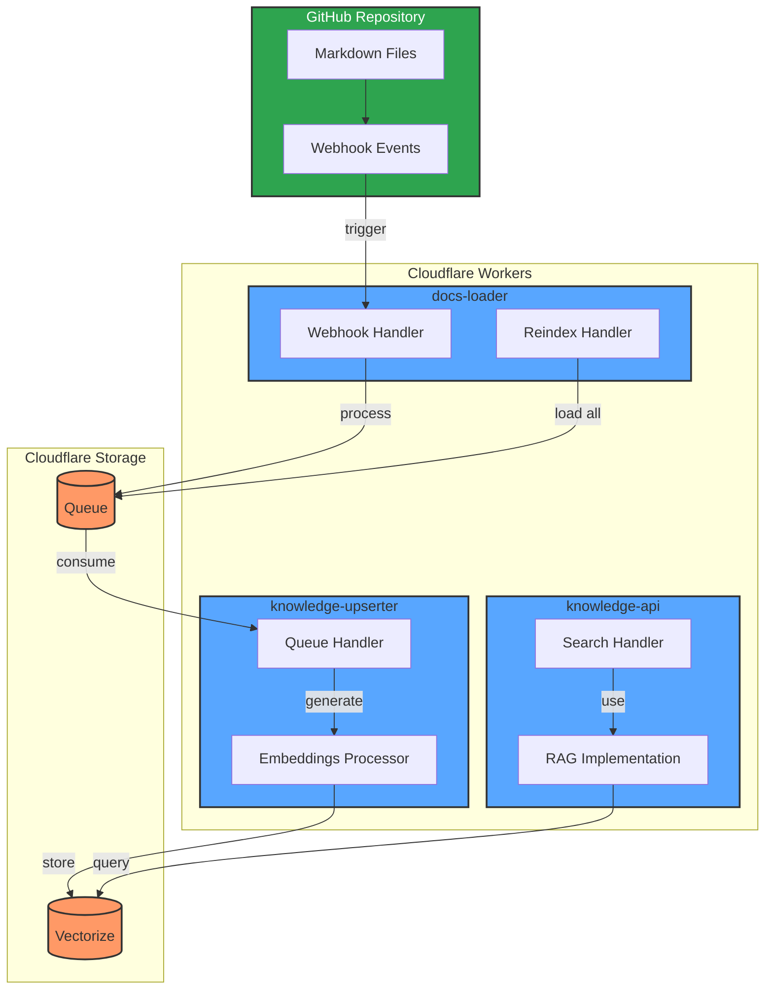
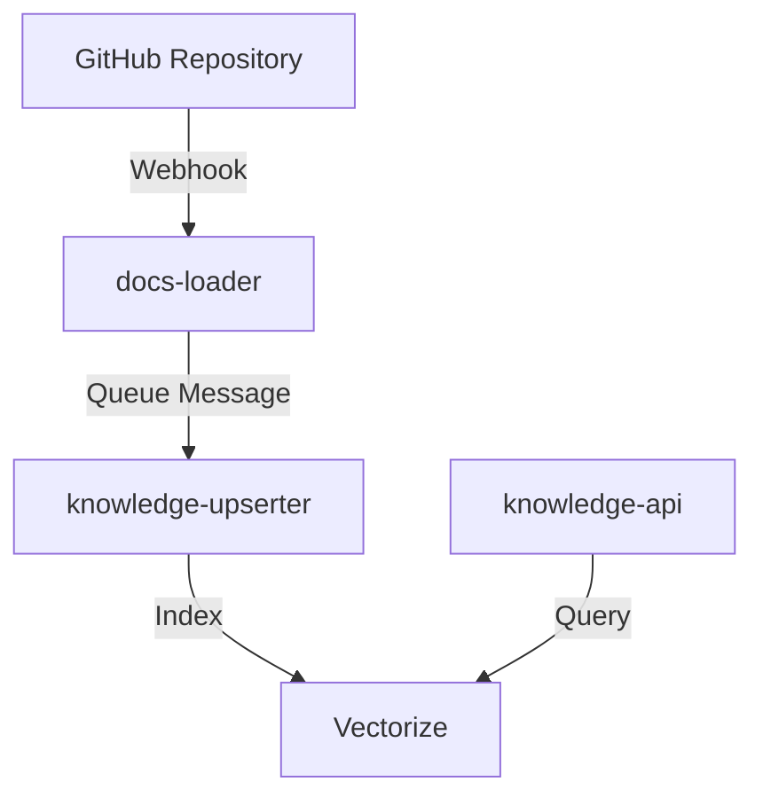

# Cloudflare Workers for 23people Handbook

This directory contains Cloudflare Workers that handle different aspects of the 23people Handbook's content processing and indexing pipeline.

## Project Structure

```text
cf-workers/
├── shared/              # Shared code between workers
│   ├── types/           # TypeScript type definitions
│   ├── readers/         # Content readers implementations
│   └── utils/           # Shared utilities
│
├── docs-loader/         # Worker to handle GitHub webhooks and content loading
├── knowledge-upserter/  # Worker to process and index documents
└── knowledge-api/       # Worker to handle RAG queries (planned)
```

## Workflow



## Workers

### docs-loader

Handles GitHub webhooks and document loading from the handbook repository.

- **Main Features**:
    - Processes GitHub push webhooks
    - Loads markdown files from the repository
    - Validates webhook signatures
    - Queues documents for processing

- **Endpoints**:
    - `POST /webhook`: GitHub webhook endpoint
    - `POST /reindex`: Manually trigger full content reindexing

### knowledge-upserter (WIP)

Processes documents and updates the vector store.

### knowledge-api (Planned)

Will handle RAG-based queries against the indexed content.

## Shared Code

The `shared` directory contains code used across multiple workers:

- **Types**: Common TypeScript interfaces and types
- **Readers**: Implementations for different content sources
- **Utils**: Shared utility functions

## Development

### Prerequisites

- Node.js 18+
- npm
- Wrangler CLI (`npm install -g wrangler`)

### Setup

1. Install dependencies:

```bash
npm install
```

2. Set up environment variables:

```bash
cd docs-loader
wrangler secret put GITHUB_WEBHOOK_SECRET
wrangler secret put GITHUB_APP_ID
wrangler secret put GITHUB_APP_PRIVATE_KEY
wrangler secret put GITHUB_APP_INSTALLATION_ID
```

### Local Development

```bash
cd <worker-directory>
npm run dev
```

### Deployment

```bash
cd <worker-directory>
npm run deploy
```

## GitHub App Configuration

The workers interact with GitHub through a GitHub App. To set up:

1. Create a GitHub App in your organization
2. Generate a private key
3. Install the app in your repository
4. Configure webhook settings:
   - Webhook URL: Your docs-loader worker URL
   - Secret: Match with GITHUB_WEBHOOK_SECRET
   - Events: Push events

## Architecture



- **docs-loader**: Entry point for content changes
- **knowledge-upserter**: Processing and indexing
- **knowledge-api**: Query interface
- **Vectorize**: Vector store for embeddings

## Contributing

1. Create a feature branch
2. Make your changes
3. Submit a pull request

## License

See the LICENSE file in the root directory.
