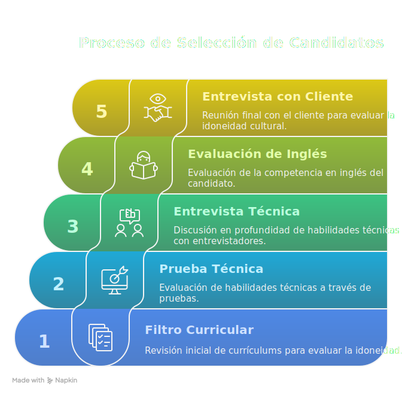
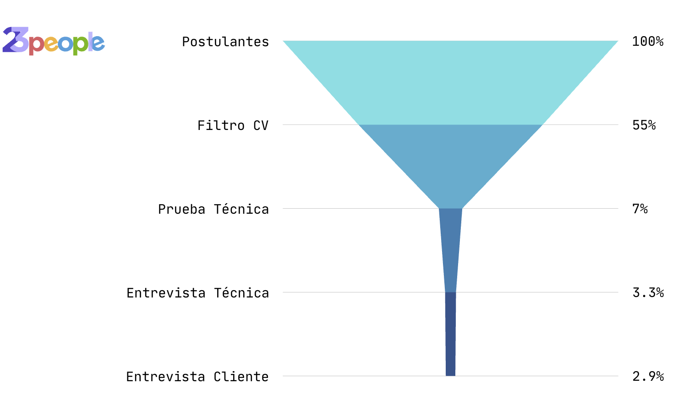

# Proceso de Selección

El objetivo de nuestro proceso de selección es encontrar a profesionales que se encuentran en el top 10% del mercado, son nuestros profesionales "10X". Para lograr eso basamos nuestro proceso en tres idea principales:

1. **Capacidad Técnica > Habilidades Blandas**. Priorizamos la capacidad técnica en el sentido que es más compleja de desarrollar que las habilidades blandas. 
2. **Profundidad**. Los buenos profesionales no se quedan sólo con las tareas a resolver, si no que van más allá e investigan la teoría de lo que está detrás.
3. **Aprendizaje contínuo**: es lo único constante en el desarrollo de las carreras de tecnología.

**¿Por qué profesionales 10X?**

Dividimos nuestro proceso de selección en 5 etapas.

## Filtro Curricular

En cada publicación analizamos los CVs recibidos con una mezcla de ATS automatizado basado en IA y supervisión humana. 

Filtramos aproximadamente un 50% de los CVs recibidos. Las razones principales para rechazar un CV son las siguientes:

- No indican las tecnologías requeridas en la publicación. 
- No reflejan la experiencia requerida para la posición.
- CVs genéricos que no apuntan a lo solicitado.
- Personas de otras profesiones u oficios sin ninguna experiencia ni conocimiento en en el área.

## Prueba Técnica

Realizamos una prueba técnica de programación utilizando una plataforma online. La prueba consiste en ejercicios de programación en el lenguaje que más le acomode al candidato. El objetivo de esta prueba es evaluar la capacidad algorítmica y de abstracción en varios niveles, características que comparten los buenos programadores.

En general el proceso actual es el resultado de un largo proceso de pruebas y errores entendiendo qué es lo que define a un buen profesional TI. Hemos intentado con diversas pruebas estandarizadas, algunas más simples y otras más complejas que al final no eran buenos predictores del desempeño. La prueba de recursividad hasta ahora es el mejor predictor que conocemos y es la razón del por qué la aplicamos.

## Entrevista Técnica

El objetivo de la entrevista técnica es validar la experiencia del postulante en base a los requerimientos de la posición. Se evalúa que en las tecnologías requeridas el postulante haya profundizado lo suficiente en la teoría detrás de cada una. Además se evalúa que el postulante tenga el hábito del aprendizaje contínuo. 

## Evaluación de Inglés

Cuando lo requiere el cliente, se realiza una evaluación del nivel de inglés. 

## Entrevista con Cliente

La entrevista final con el cliente se evalúa el fit cultural, conocimiento técnico y las habilidades de comunicación del postulante. Es el cliente quién tiene la última palabra sobre con qué profesional desea trabajar. 

## Estadísticas

Basándonos en datos actuales nuestro flujo actual permite filtrar al 3.3% del grupo de postulantes que corresponde aproximadamente a un 10% de los postulantes que pasan el filtro curricular. 

