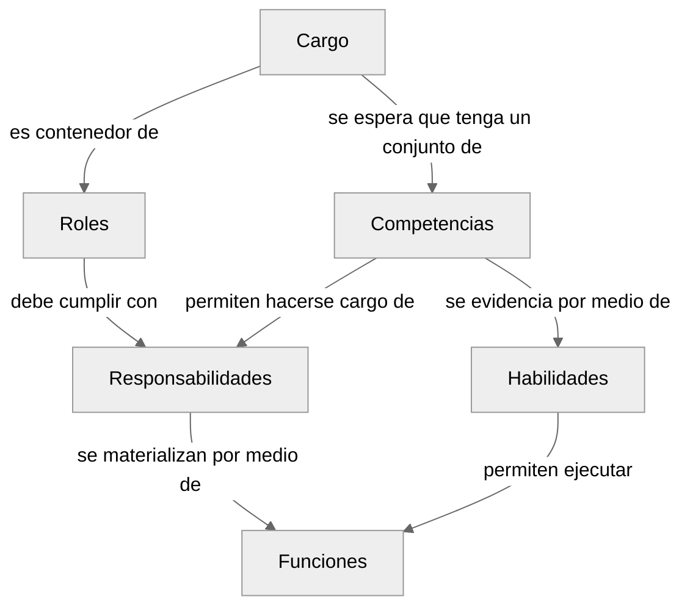

# Estructura Organizacional: Relación entre Conceptos

Los cargos laborales, roles, funciones y responsabilidades forman una jerarquía de conceptos organizacionales interconectados que evolucionan de lo estructural a lo operativo.

## Relación de Conceptos

El **cargo laboral** representa la posición formal en la estructura organizacional. Es más permanente en el tiempo y tiene niveles jerárquicos. Un cargo solo puede estar asociado a una y solo una persona. Actúa como un contenedor que puede albergar múltiples roles y define las competencias fundamentales requeridas para desempeñarlos. Estas competencias se evidencian a través de habilidades específicas y medibles que la persona debe poseer.

Los **roles**, a su vez, son más flexibles en el tiempo y definen ámbitos de acción específicos. Son el mecanismo mediante el cual las **competencias** del cargo se aplican en contextos concretos de la organización, ya sea en equipos específicos o tareas determinadas. Los roles materializan estas competencias a través de **responsabilidades** concretas (los resultados esperados) y las **funciones** necesarias para alcanzarlas. De esta manera, un mismo cargo puede aplicar sus competencias de diferentes formas según el rol que esté desempeñando en cada contexto organizacional.

Finalmente, las funciones son las actividades específicas y tangibles que permiten cumplir con esas responsabilidades. Cada responsabilidad se implementa mediante una o más funciones específicas que contribuyen directamente a su cumplimiento. Las funciones son la materialización práctica de las **habilidades** del cargo en el contexto específico de cada rol.

## Diagrama de Relación

## Detalles por Concepto

### Cargo

- Es una posición formal y permanente
- Define nivel organizacional y trayectoria profesional
- Contiene competencias y habilidades fundamentales
- Puede desempeñar múltiples roles
- Se asocia a una única persona

### Competencias

- Son capacidades fundamentales del cargo
- Definen el "cómo" se debe abordar el trabajo
- Son transferibles entre roles
- Se evidencian mediante habilidades

### Habilidades

- Son capacidades específicas y medibles
- Evidencian las competencias
- Se materializan en funciones
- Son herramientas para la ejecución

### Roles

- Son ámbitos de acción específicos en equipos o tareas organizacionales
- Más flexibles y dinámicos que el cargo
- Son el mecanismo de aplicación de las competencias del cargo
- Materializan las competencias mediante responsabilidades y funciones
- Permiten que un mismo cargo aplique sus competencias de diferentes formas según el contexto

### Responsabilidades

- Son resultados esperados del rol
- Definen el "para qué" de cada rol
- Requieren combinación de competencias
- Se implementan mediante funciones

### Funciones

- Son actividades específicas y tangibles
- Implementan las responsabilidades
- Materializan las habilidades
- Son medibles y evaluables

## Relaciones Clave

1. Cargo → Roles: Un cargo puede desempeñar múltiples roles
2. Competencias → Responsabilidades: Las competencias se aplican para cumplir responsabilidades
3. Habilidades → Funciones: Las habilidades se materializan en funciones específicas
4. Responsabilidades → Funciones: Cada responsabilidad se cumple mediante funciones concretas
