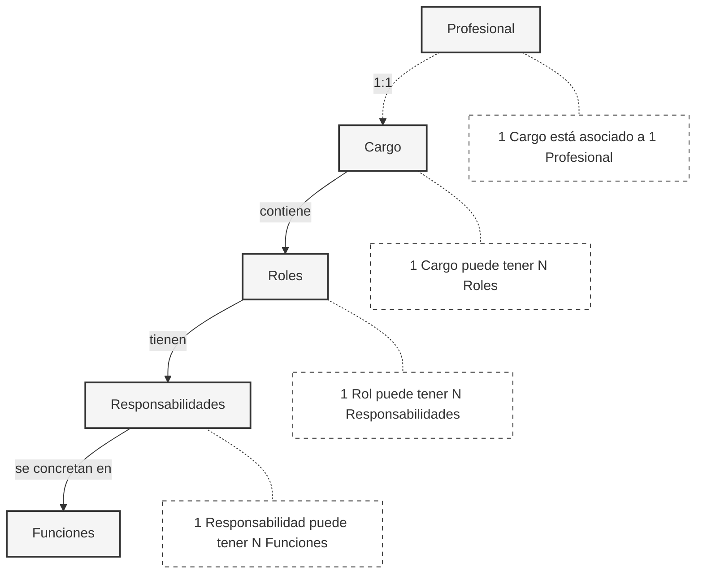

# Jerarquía Organizacional: Cargos, Roles, Responsabilidades y Funciones

## Relación de Conceptos

Los cargos laborales, roles, funciones y responsabilidades forman una jerarquía de conceptos organizacionales interconectados que evolucionan de lo estructural a lo operativo.

El **cargo laboral** representa la posición formal en la estructura organizacional. Es más permanente en el tiempo y tiene niveles jerárquicos. Un cargo solo puede estar asociado a una y solo una persona. Actúa como un contenedor que puede albergar múltiples roles.

Los **roles**, a su vez, son más flexibles en el tiempo y definen ámbitos de acción específicos y se materializan a través de **responsabilidades** concretas - los resultados esperados.

Finalmente, las **funciones** son las actividades específicas y tangibles que permiten cumplir con esas responsabilidades. Cada responsabilidad se implementa mediante una o más funciones específicas que contribuyen directamente a su cumplimiento.

## Esquema de Relaciones

## Ejemplos

A continuación, se presentan ejemplos de cómo se relacionan estos conceptos en la práctica organizacional, mostrando claramente la relación entre responsabilidades y sus funciones específicas.

### Ejemplo 1: Senior Software Engineer

**Cargo:** Senior Software Engineer

- **Rol: Technical Lead**
    1. **Responsabilidad:** Diseño de arquitectura de servicios
        - **Funciones:**
            - Revisar diseños de arquitectura propuestos
            - Liderar sesiones técnicas de diseño
            - Documentar decisiones de arquitectura

    2. **Responsabilidad:** Aseguramiento de calidad técnica
        - **Funciones:**
            - Validar estándares de código
            - Supervisar implementación de patrones de diseño
            - Realizar auditorías de calidad de código

    3. **Responsabilidad:** Mentoring técnico del equipo
        - **Funciones:**
            - Realizar sesiones de mentoring programadas
            - Proporcionar feedback técnico en code reviews
            - Crear materiales de capacitación técnica

- **Rol: Cloud Infrastructure Owner**
    1. **Responsabilidad:** Gestión de infraestructura cloud
        - **Funciones:**
            - Diseñar arquitectura cloud de servicios
            - Supervisar implementaciones de IaC
            - Mantener documentación de infraestructura

    2. **Responsabilidad:** Optimización de recursos y costos
        - **Funciones:**
            - Monitorear y analizar costos cloud mensuales
            - Implementar estrategias de optimización
            - Generar reportes de eficiencia de recursos

### Ejemplo 2: Senior People Manager

**Cargo:** Senior People Manager

- **Rol: Compensation & Benefits Administrator**
    1. **Responsabilidad:** Gestión integral de remuneraciones
        - **Funciones:**
            - Supervisar proceso de payroll mensual
            - Validar cálculos de remuneraciones
            - Revisar declaraciones previsionales

    2. **Responsabilidad:** Administración de beneficios corporativos
        - **Funciones:**
            - Gestionar programa de beneficios
            - Actualizar políticas de beneficios
            - Coordinar con proveedores de beneficios

- **Rol: Labor Compliance Leader**
    1. **Responsabilidad:** Asegurar cumplimiento normativo laboral
        - **Funciones:**
            - Supervisar proceso de contratos y anexos
            - Gestionar auditorías laborales
            - Mantener registro de cumplimiento normativo

    2. **Responsabilidad:** Gestión de documentación legal
        - **Funciones:**
            - Validar documentación legal requerida
            - Mantener actualización de políticas
            - Coordinar con asesores legales externos

- **Rol: Employee Experience Owner**
    1. **Responsabilidad:** Gestión del ciclo de vida laboral
        - **Funciones:**
            - Liderar programa de onboarding
            - Gestionar proceso de evaluaciones de desempeño
            - Coordinar procesos de offboarding

    2. **Responsabilidad:** Desarrollo de cultura organizacional
        - **Funciones:**
            - Coordinar actividades de cultura
            - Implementar iniciativas de engagement
            - Monitorear indicadores de clima laboral

- **Rol: HR Analytics Lead**
    1. **Responsabilidad:** Gestión de métricas e indicadores HR
        - **Funciones:**
            - Generar reportes mensuales de gestión HR
            - Mantener dashboard de indicadores clave
            - Analizar tendencias de personal

    2. **Responsabilidad:** Optimización de procesos HR
        - **Funciones:**
            - Documentar procesos actuales
            - Identificar oportunidades de mejora
            - Implementar optimizaciones basadas en datos
