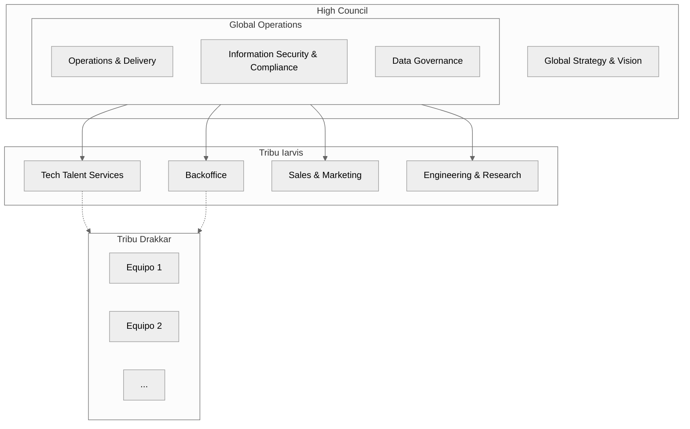

# Nuestra Organización

En 23people nos organizamos en equipos multidisciplinarios. Cada equipo tiene un propósito claro y bien definido, y es responsable de la entrega de servicios a otros equipos internos o a clientes externos.

## Estructura Organizacional

La siguiente es un diagrama que ilustra la estructura organizacional de 23people:

Se puede observar que la estructura organizacional de 23people se compone de varios niveles jerárquicos y equipos multidisciplinarios que trabajan juntos para cumplir con los objetivos estratégicos de la organización.

Además, en 23people utilizamos el concepto de **Tribu** para agrupar equipos que comparten objetivos y propósitos comunes. Cada Tribu tiene un nombre y una identidad propia, y se relaciona con otras Tribus y equipos en la organización.

Estos son los principales componentes de nuestra estructura organizacional:

- [High Council](councils/high-council.md). Este es el equipo responsable de definir la estrategia global y la visión de 23people.
- [Tribu Iarvis](/organization/tribes/iarvis-tribe/). Es el nombre del conjunto de equipos operacionales y de entrega de servicios de 23people.
    - [Tech Talent Services Team](/organization/teams/tech-talent-services/)
    - [Backoffice Team](/organization/teams/backoffice/)
    - [Sales & Marketing Team](/organization/teams/sales-and-marketing/)
    - [Engineering & Research Team](/organization/teams/engineering-and-research/)
- [Tribu Drakkar](/organization/tribes/drakkar-tribe). Es el nombre del conjunto de equipos de Profesionales Tech que están en modo subcontratación en 23people.
