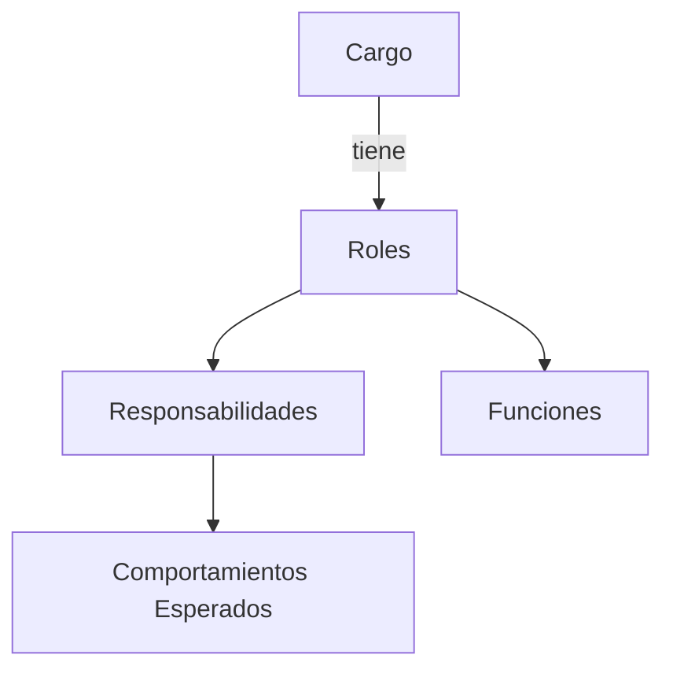

# Nuestra Organización

En 23people nos organizamos en equipos multidisciplinarios. Cada equipo tiene un propósito claro y bien definido, y es responsable de la entrega de servicios a otros equipos internos o a clientes externos.

## Estructura Organizacional

La estructura general es circular tal de fomentar la colaboración y la comunicación entre los equipos y capas organizacionales.

## Equipos Operacionales

Los siguientes son los equipos operacionales de 23people y su propósito:

- [**Tech Talent Services Team (TTS)**](teams/tech-talent-services). Dar la mejor experiencia en selección, validación y retención de Profesionales Tech que realmente les apasiona lo que hacen en tecnología y que mejor hacen match con los proyectos de nuestros clientes.
- [**Sales & Marketing Team (S&M)**](teams/sales-and-marketing). Responsable de la adquisición de nuevos clientes y de la gestión de las relaciones comerciales con los clientes actuales, ademas de hacer crecer la marca, presencia y participación de servicios de 23people.
- [**Backoffice Services Team (BKO)**](teams/backoffice). Dar la mejor experiencia en soporte administrativo empresarial, facilitanto el éxito de nuestros equipos mediante una gestión administrativa ágil y eficiente que les permita enfocarse en lo que mejor saben hacer.
- [**Research & Development Services Team (R&D)**](teams/research-and-development). Potenciar la evolución digital de nuestros clientes explorando y dominando tecnologías emergentes que generen valor real en sus operaciones.

Todos estos equipos operacionales se agrupan bajo el nombre de la [**Tribu Iarvis**](tribes/iarvis-tribe/).

### Modelo Interno

Cada equipo tiene autonomía entorno a un próposito bien definido y un contrato de servicios que se compromete a entregar. Estos contratos funcionan similar a como funcionan las [API](https://aws.amazon.com/what-is/api/) y se espera que se especifique: que entrega, que esperar del servicio y como se solicita. Cada equipo debe medir constantemente la calidad de sus servicios y su eficiencial operacional, para luego mejorarlos de manera iterativa basandose en datos y experiencia acumulada.

### Gestión y Liderazgo Operacional

Los equipos operacionales están liderados por el rol del [**Global Operations Manager**](workforce/roles/global-operations-manager/). Además, cada equipo cuenta con un/a líder que cumple con el rol principal de [**Service Request Manager (SRM)**](workforce/roles/service-request-manager.md) y secundariamente con el rol de [**Service Delivery Manager (SDM)**](workforce/roles/service-delivery-manager.md).

### Equipo Estratégico

Se persigue que cada equipo sea autónomo en el cómo avanza en su propósito, sin embargo se busca también que estén alineados con los objetivos estrategicos de la organización. Para ello, se cuenta con un equipo estratégico llamado [**High Council**](councils/high-council.md) que se encarga de definir y comunicar la estrategia de la organización y de asegurar que los equipos operacionales estén alineados con ella.

## Cargos y Roles

Nos organizamos además en base a [**Cargos**](workforce/positions/) y [**Roles**](workforce/roles/), que definen las responsabilidades y comportamientos esperados de cada miembro de la organización. Cada cargo, puede tener uno o mas roles asignados, los cuales definen las responsabilidades y funciones necesarias para el cargo.

En 23people, entendemos los cargos y roles como dos conceptos distintos pero complementarios que estructuran nuestra organización y la forma en que trabajamos.

### Relación entre Cargos, Roles y Equipos

Los cargos no están limitados a un equipo específico. Un mismo cargo puede existir en diferentes equipos de 23people (Tech Talent Services, Sales & Growth Marketing, Backoffice Services, Research & Development), y el profesional puede desempeñar distintos roles según el equipo donde se encuentre. Por ejemplo:

- Un **Senior Software Engineer** podría estar:
    - En R&D Services como Tech Lead de un proyecto de innovación
    - En Tech Talent Services como Technical Interviewer
    - En cualquier equipo como Software Architect

- Un **Data Engineer** podría estar:
    - En R&D Services desarrollando soluciones de datos
    - En Tech Talent Services analizando métricas de reclutamiento
    - En Sales & Growth Marketing trabajando con datos de ventas

Esta flexibilidad permite:

- Aprovechar las competencias base del cargo en diferentes contextos
- Facilitar la movilidad interna y el desarrollo profesional
- Mantener consistencia en los niveles y expectativas a través de la organización

### Aspectos Organizacionales

#### Autonomía y Responsabilidad

- Cada nivel superior implica mayor autonomía estratégica
- El alcance de responsabilidad aumenta progresivamente
- El impacto de decisiones se amplía en niveles superiores
- La contribución evoluciona de tareas específicas a metas organizacionales

#### Alineación Organizacional

- La estructura soporta la jerarquía de contribución del trabajo
- Permite desarrollo en carreras técnicas y de gestión
- Facilita la trazabilidad desde tareas hasta metas de largo plazo
- Soporta el modelo de tribus y equipos

#### Evaluación y Promoción

- Se basa en la demostración de capacidades del siguiente nivel
- Considera impacto en la jerarquía de contribución
- Evalúa tanto competencias técnicas como estratégicas
- Requiere crecimiento consistente y verificable

## Principios

Todos los equipos de 23people deben orientar sus actividades diarias según los siguientes principios:

- **Propósito claro y bien definido**: Cada equipo tiene un propósito que actúa como brújula en su día a día. Es su razón de existir en 23people y lo que motiva su avance.
- **Autonomía en torno a su propósito**: Cada equipo es autónomo en la forma de avanzar hacia su propósito, alineándose con los [objetivos estratégicos](../strategy/goals.md), [valores](../culture/values.md) y [prácticas generales](../culture/practices/) de la organización.
- **Cumplimiento del propósito mediante contratos de servicio**: Cada equipo persigue su propósito entregando servicios a otros equipos internos o a clientes externos. Estos servicios están bien definidos en forma de contrato de servicio (similar a una API). Toda la organización debe conocer qué esperar de cada equipo y cómo solicitar sus servicios.
- **Mejora iterativa basada en datos**: Los equipos mejoran sus servicios implementando ideas que aportan de manera medible a la eficiencia operacional y calidad. Estas mejoras se fundamentan en su experiencia, datos recolectados y nuevas ideas que desean poner a prueba.
