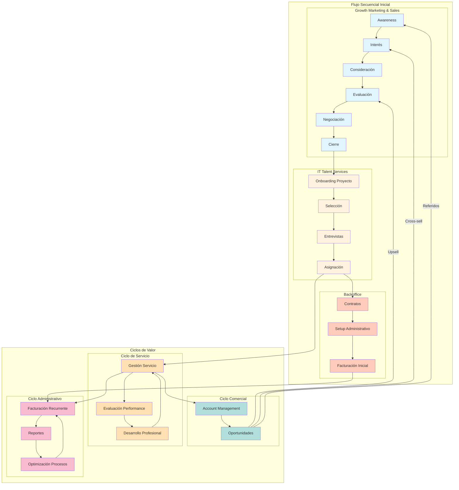

# Interacciones entre Equipos

A continuación, se muestran las principales interacciones que existen entre los equipos de 23people, y cómo se relacionan entre sí para lograr un objetivo común. Esto se hace a través de flujos de trabajo y ciclos de mejora y de valor que permiten a la organización mejorar continuamente y adaptarse a los cambios del mercado.

## Esquema general

