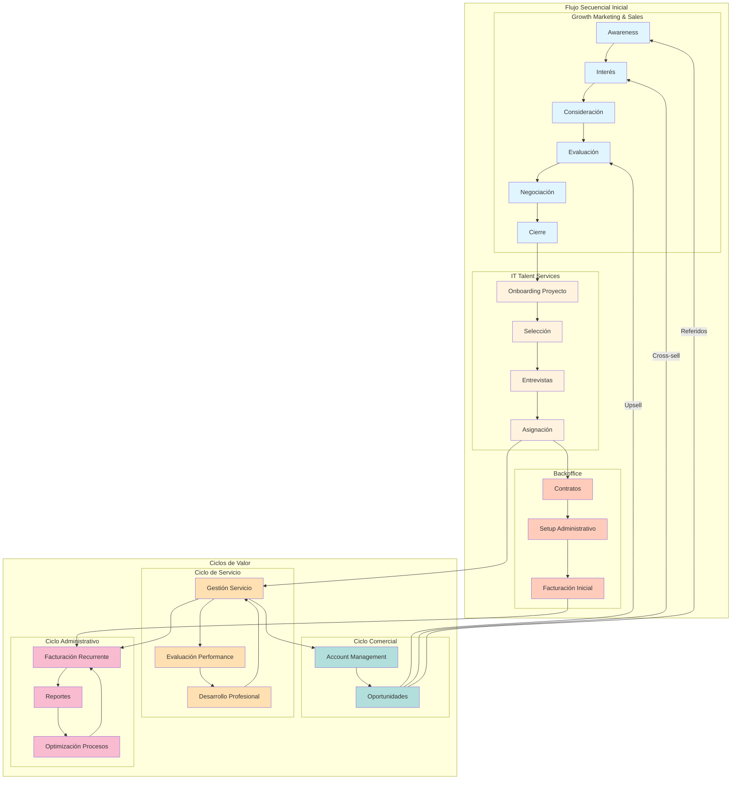

# Interacción entre Equipos

A continuación, un esquema de cómo se relacionan los equipos de 23people entre sí:

```mermaid
flowchart TD
    subgraph "Flujo Secuencial Inicial"
        subgraph GMS["Growth Marketing & Sales"]
            A[Awareness] --> B[Interés]
            B --> C[Consideración]
            C --> D[Evaluación]
            D --> E[Negociación]
            E --> F[Cierre]
        end

        subgraph ITS["IT Talent Services"]
            G[Onboarding Proyecto] --> H[Selección]
            H --> I[Entrevistas]
            I --> J[Asignación]
        end

        subgraph BO["Backoffice"]
            K[Contratos] --> L[Setup Administrativo]
            L --> M[Facturación Inicial]
        end

        F --> G
        J --> K
    end

    subgraph "Ciclos de Valor"
        subgraph CicloComercial["Ciclo Comercial"]
            N[Account Management] --> O[Oportunidades]
            O --> |Upsell| D
            O --> |Cross-sell| B
            O --> |Referidos| A
        end

        subgraph CicloServicio["Ciclo de Servicio"]
            P[Gestión Servicio] --> Q[Evaluación Performance]
            Q --> R[Desarrollo Profesional]
            R --> P
        end

        subgraph CicloAdmin["Ciclo Administrativo"]
            S[Facturación Recurrente] --> T[Reportes]
            T --> U[Optimización Procesos]
            U --> S
        end

        P --> N
        P --> S
    end

    J --> P
    M --> S

    style A fill:#e1f5fe
    style B fill:#e1f5fe
    style C fill:#e1f5fe
    style D fill:#e1f5fe
    style E fill:#e1f5fe
    style F fill:#e1f5fe
    style G fill:#fff3e0
    style H fill:#fff3e0
    style I fill:#fff3e0
    style J fill:#fff3e0
    style K fill:#ffccbc
    style L fill:#ffccbc
    style M fill:#ffccbc
    style N fill:#b2dfdb
    style O fill:#b2dfdb
    style P fill:#ffe0b2
    style Q fill:#ffe0b2
    style R fill:#ffe0b2
    style S fill:#f8bbd0
    style T fill:#f8bbd0
    style U fill:#f8bbd0
```
