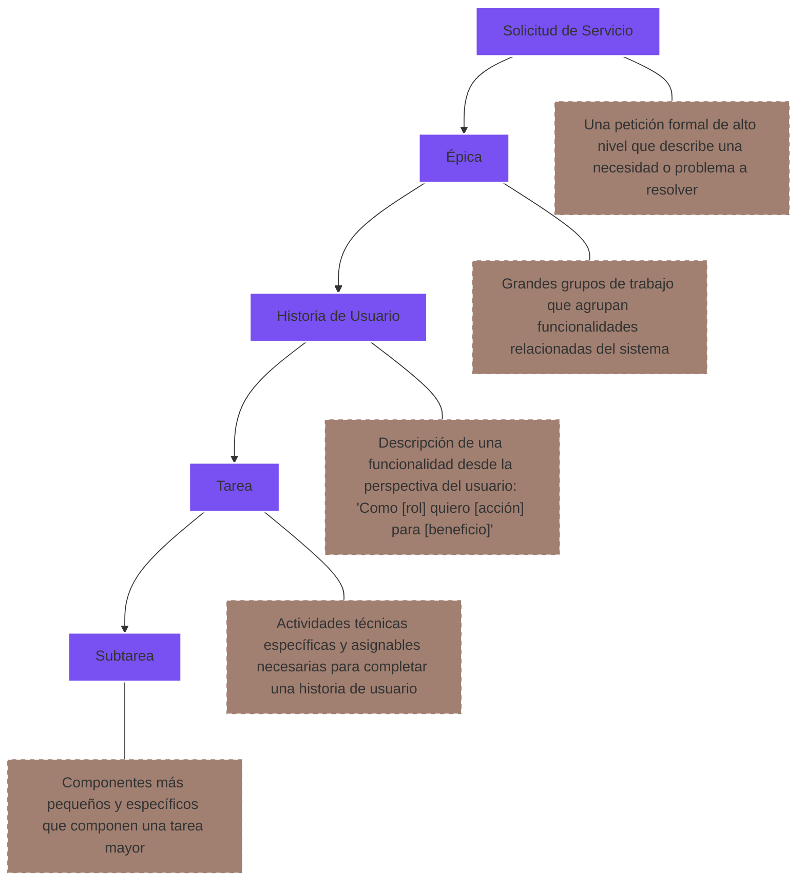

# Niveles de trabajo

```mermaid
graph TD
    SR[Solicitud de Servicio] --> EPIC[Épica]
    EPIC --> US[Historia de Usuario]
    US --> TASK[Tarea]
    TASK --> SUBTASK[Subtarea]

    note_sr[Una petición formal de alto nivel que describe una necesidad o problema a resolver]
    note_epic[Grandes grupos de trabajo que agrupan funcionalidades relacionadas del sistema]
    note_us[Descripción de una funcionalidad desde la perspectiva del usuario: 'Como #91;rol#93; quiero #91;acción#93; para #91;beneficio#93;']
    note_task[Actividades técnicas específicas y asignables necesarias para completar una historia de usuario]
    note_subtask[Componentes más pequeños y específicos que componen una tarea mayor]

    SR --- note_sr
    EPIC --- note_epic
    US --- note_us
    TASK --- note_task
    SUBTASK --- note_subtask

    classDef default fill:#7950f2,stroke:#fff,stroke-width:2px
    classDef note fill:#a18072,stroke:#fff,stroke-width:1px,stroke-dasharray: 5
    class note_sr,note_epic,note_us,note_task,note_subtask note
```
