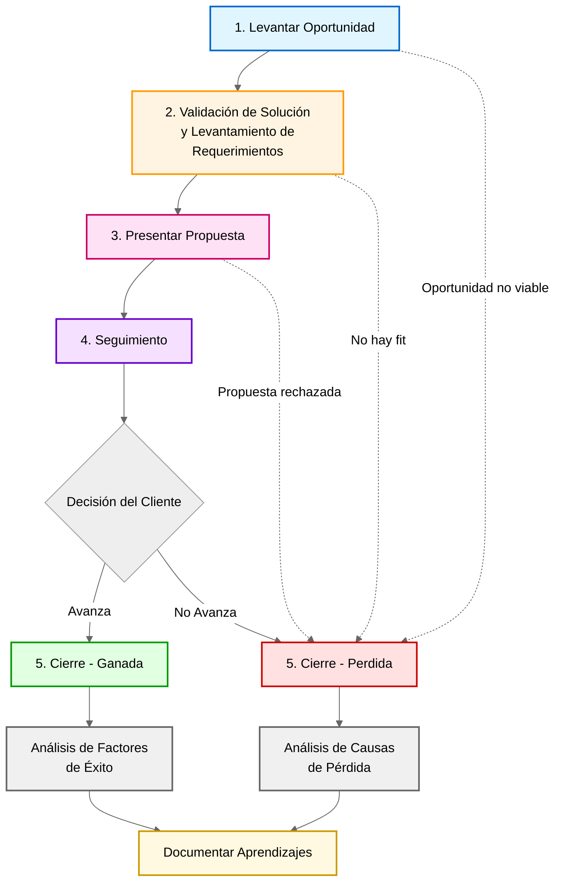

# Flujo de Ventas Consultiva de 23people

## Propósito

El Proceso de Venta Consultiva es la metodología estructurada de 5 etapas que tenemos en 23people para maximizar la conversión de ventas complejas y de alto valor. Cada etapa tiene objetivos claros y señales concretas que indican cuándo es apropiado avanzar al siguiente paso.

Este proceso está diseñado para **Ventas Consultivas Corporativas** (proyectos complejos y de alto valor), no para ventas transaccionales. En grandes ventas, es fundamental que el vendedor guíe al cliente a dar el siguiente paso en cada interacción.

!!! info "El rol del Vendedor Consultivo"

    El rol del vendedor es posicionar a 23people como **asesor experto confiable** que ayuda al cliente a resolver realmente su problema. No debemos ser un "Cotizador de Requerimientos".

## Pipeline de Ventas Consultivas (Proceso)

El siguiente diagrama ilustra el Flujo General de las Ventas Consultivas en 5 etapas:

!!! info "Este es un flujo de Oportunidades Calificadas"

    Los items que pasarán en cada etapa corresponden a **Oportunidades Calificadas de Venta Consultiva**:

    - Son oportunidades que vienen desde el [Flujo de Prospección](./prospection-workflow.md).
    - Han sido calificadas como viables para avanzar en el proceso de ventas.

La siguiente tabla resume las 5 etapas del proceso de venta consultiva:

| Etapa                                                       | Objetivo Principal                                                                                                                                                 |
| ----------------------------------------------------------- | ------------------------------------------------------------------------------------------------------------------------------------------------------------------ |
| **1. Levantar Oportunidad** | Identificar necesidad real del cliente, validar que 23people puede ayudar, obtener compromiso para avanzar |
| **2. Validación de la Solución y Levantamiento de Requerimientos** | Mostrar expertise, validar que la solución propuesta tiene sentido para el cliente, determinar requerimientos específicos para cotizar |
| **3. Presentar Propuesta** | Presentar formalmente la solución previamente acordada y ser seleccionado como proveedor experto |
| **4. Seguimiento** | Generar "duda emocional" en el cliente para asegurar cooperación y transparencia en el flujo de información sobre el estado de la oportunidad |
| **5. Cierre** | Analizar y determinar causas específicas que llevaron al resultado de la oportunidad (ganada o perdida) |

## Etapa 1. Levantar Oportunidad

### Objetivo

Identificar la necesidad real del cliente, validar que 23people puede efectivamente ayudar a resolver su problemática, y obtener un compromiso claro del cliente para avanzar al siguiente paso del proceso.

Esta etapa es fundamental para establecer las bases de una relación comercial exitosa, asegurando que ambas partes estén alineadas en cuanto a expectativas y viabilidad de la solución.

### Definición de Listo

Las siguientes condiciones deben cumplirse para considerar esta etapa completada y avanzar a la siguiente. Se debe tomar como un checklist:

1. **Compromiso de Continuidad**: El cliente acepta activamente programar y asistir a la próxima reunión, demostrando interés genuino en explorar la solución.

2. **Generación de Gancho**: Se logra crear un "gancho" efectivo que muestra al cliente **CÓMO** se resuelve su problema específico, no solo **QUÉ** se puede hacer. Este gancho debe ser concreto y relevante para su situación.

3. **Apertura a la Investigación**: El cliente acepta y responde activamente a preguntas de investigación que permiten profundizar en la comprensión de sus necesidades, desafíos y contexto organizacional.

4. **Temporalidad Definida**: Se ha identificado y confirmado una fecha de implementación clara, lo que indica seriedad y urgencia en la necesidad del cliente.

### Buenas Prácticas

1. Durante esta etapa, enfócate en escuchar activamente al cliente y hacer preguntas abiertas que revelen la profundidad de su problema. No avances a la siguiente etapa hasta que tengas confirmación explícita de que el cliente ve valor en continuar la conversación.

2. **Aplicar las 4 etapas de la entrevista**: En esta primera reunión, dedica máximo 10 minutos a la Apertura, luego enfócate en Investigación (el cliente debe hablar más que tú), Muestra Aptitud con casos relevantes, y cierra buscando Compromiso de Avance para una segunda reunión.

## Etapa 2. Validación de la Solución y Levantamiento de Requerimientos

### Objetivo

Demostrar expertise y conocimiento profundo del dominio del problema, validar que la solución propuesta tiene sentido y cumple con las expectativas del cliente, y determinar los requerimientos específicos necesarios para elaborar una propuesta económica precisa.

Esta etapa transforma el interés inicial en un entendimiento compartido de la solución y los requisitos para su implementación.

### Definición de Listo

Las siguientes condiciones deben cumplirse para considerar esta etapa completada y avanzar a la siguiente. Se debe tomar como un checklist:

1. **Validación de Solución**: El cliente confirma explícitamente que la solución propuesta tiene sentido para su contexto, cumple con sus expectativas y aborda efectivamente sus necesidades identificadas.

2. **Compromiso Activo de Avance**: El cliente toma la iniciativa de dar el siguiente paso, expresando interés concreto en continuar el proceso y profundizar en los detalles de la implementación.

3. **Desbloqueo de Información**: Se obtiene acceso a información más detallada mediante mecanismos formales como la firma de un Acuerdo de Confidencialidad (NDA) o el registro como proveedor oficial, indicando que el cliente está dispuesto a compartir información sensible.

4. **Claridad en Requerimientos**: Se determina de manera concreta y específica qué elementos, información y detalles se necesitan para elaborar una propuesta económica que responda con precisión a las necesidades del cliente.

### Buenas Prácticas

1. **Mostrar Aptitud**: En esta etapa, es crucial demostrar conocimiento del sector y casos similares. Comparte ejemplos relevantes (casos de éxito) que refuercen tu posición como experto. Asegúrate de documentar todos los requerimientos con precisión para evitar sorpresas en etapas posteriores.

2. **Criterio de calificación**: El vendedor debe ser capaz de calificar las oportunidades. Si determinaste que no hay oportunidad real, está perfecto. Madurar para decir "no" frente a algo es parte del rol comercial. El tiempo es escaso para ambos lados.

3. **No Crear Cotizaciones Prematuras**: No enviar cotización antes de lograr posicionarte como experto. Crear cotizaciones ocupa tiempo valioso. Si el cliente pide cotización en la primera reunión, primero logra que te permita ahondar más en su necesidad. Recuerda: antes de que se genere el valor, todo es caro para el cliente.

## Etapa 3. Presentar Propuesta

### Objetivo

Presentar formalmente la solución técnico-comercial previamente acordada y posicionarse como el proveedor experto seleccionado para implementar la solución.

**Principio fundamental**: Las cotizaciones no se envían, se presentan. Esta distinción es crítica para mantener el control del proceso y poder aclarar dudas en tiempo real.

### Definición de Listo

Las siguientes condiciones deben cumplirse para considerar esta etapa completada y avanzar a la siguiente:

1. **Reunión de Aclaración Inmediata**: Se agenda una reunión para aclarar dudas inmediatamente después de la presentación de la propuesta, permitiendo abordar objeciones y refinar detalles mientras el interés está en su punto más alto.

2. **Inversión de Tiempo del Cliente**: El cliente demuestra su compromiso invirtiendo tiempo en asistir personalmente a la presentación, en lugar de simplemente solicitar que se le envíe el documento para revisión posterior.

3. **Participación de Tomadores de Decisión**: Los tomadores de decisión relevantes (como el Gerente de TI, Director de Tecnología, u otros stakeholders clave) están presentes en la presentación, indicando que la oportunidad tiene prioridad organizacional.

4. **Señales Previas de Aceptación**: Existen indicadores concretos previos a la presentación que sugieren fuertemente que la propuesta será aceptada, como feedback positivo en reuniones preparatorias o confirmación de alineación presupuestaria.

### Buenas Prácticas

1. Nunca presentar una propuesta sin haber preparado el terreno previamente. La presentación debe ser una formalización de lo que ya has discutido y validado con el cliente. Si no tienes señales previas de aceptación, considera que aún no estás listo para esta etapa.

!!! warning "Atención"

    Recuerda: **Las cotizaciones no se envían, se presentan**. Enviar una cotización por correo sin presentación reduce dramáticamente las probabilidades de cierre y pierde el control del proceso de venta.

### Relación con el Flujo de Ventas

Esta etapa marca la transición crítica hacia [Oportunidad Comprometida](../../glossary.md#oportunidad-comprometida) en el [Flujo de Ventas General](../../glossary.md#flujo-de-ventas-general).

## 4. Seguimiento

### Objetivo

Generar una "duda emocional" positiva en el cliente que asegure su cooperación y transparencia en el flujo de información sobre el estado de la oportunidad. Esta etapa busca mantener el momentum y evitar que la oportunidad se estanque o pierda prioridad.

La "duda emocional" significa que el cliente siente que podría perder una oportunidad valiosa si no mantiene la comunicación activa, sin generar presión negativa.

### Definición de Listo

Las siguientes condiciones deben cumplirse para considerar esta etapa completada y avanzar a la siguiente:

1. **Transparencia en la Comunicación**: El cliente coopera activamente y entrega información transparente sobre posibles riesgos, retrasos, problemas internos o cambios en las prioridades que puedan afectar la oportunidad.

2. **Comunicación de Valor Continua**: Se mantiene una comunicación regular mediante el envío de material de valor (estudios de caso, artículos relevantes, actualizaciones de la industria) que continúa posicionando a 23people como experto en el dominio, sin caer en spam o comunicación irrelevante.

3. **Engagement Activo del Cliente**: El cliente toma acciones concretas que demuestran su interés continuo, como hacer clic en material de interés enviado (ej. casos de estudio), responder a comunicaciones, o compartir el material internamente con stakeholders.

4. **Feedback Proactivo**: El cliente informa proactivamente sobre avances en procesos internos (aprobaciones, presupuestos, cambios organizacionales) sin necesidad de persecución constante.

### Mejores Prácticas

!!! tip "Consejo para Seguimiento Efectivo"

    El seguimiento no es simplemente "recordarle" al cliente que existe una propuesta pendiente. Cada interacción debe aportar valor genuino. Pregúntate: "¿Este mensaje ayuda al cliente a tomar una mejor decisión o solo lo presiona?" Si es lo segundo, replantea tu enfoque.

!!! example "Ejemplo de Valor en Seguimiento"

    En lugar de: "¿Han tenido oportunidad de revisar la propuesta?"

    Prueba: "Encontré este caso de éxito de [industria similar] que implementó una solución parecida. Los resultados en el primer trimestre fueron X. ¿Les interesaría que agendemos 15 minutos para discutir cómo esto podría aplicar a su contexto?"

!!! tip "Estrategia de Seguimiento con Material de Valor"

    **Template de correo de seguimiento efectivo**:

    - Entregar material de interés relacionado con la problemática del cliente (caso de éxito, whitepaper, artículo relevante)
    - Incluir un enlace rastreable (ej. link a caso de éxito) para determinar si el cliente hizo clic
    - Si el cliente hace clic en el material, es una señal concreta de interés continuo
    - Usar esto como pie para insistir en el agendamiento de una reunión

    **Recordatorio crítico**: Si no se hace más prospección, somos rehenes de las pocas oportunidades que tenemos. Mantén el pipeline activo constantemente.

### Relación con el Flujo de Ventas

Esta etapa mantiene activas las oportunidades que están entre [Oportunidad Comprometida](../../glossary.md#oportunidad-comprometida) y [Oportunidad por Facturar](../../glossary.md#oportunidad-por-facturar), evitando que caigan en [Oportunidad Perdida](../../glossary.md#oportunidad-perdida).

## 5. Cierre

### Objetivo

Analizar sistemáticamente y determinar las causas específicas que condujeron al resultado final de la oportunidad, ya sea ganada o perdida. Este análisis es crítico para el aprendizaje organizacional y la mejora continua del proceso de ventas.

El cierre no es simplemente registrar un "sí" o un "no", sino entender el **por qué** detrás del resultado.

### Definición de Listo

Las siguientes condiciones deben cumplirse para considerar esta etapa completada:

1. **Identificación de Causas Raíz**: Se logra determinar con precisión las causas exactas y específicas que llevaron a ganar o perder la oportunidad, evitando generalizaciones o suposiciones vagas.

2. **Análisis de Atributos Diferenciadores**: Se identifica claramente si la causa del resultado fue un atributo clave diferenciador (positivo o negativo) que puede ser aprovechado con otros clientes o que requiere mejora.

3. **Documentación de Aprendizajes**: Se documentan los aprendizajes de manera estructurada y accesible para que puedan ser consultados por el equipo en oportunidades futuras.

4. **Feedback del Cliente**: Se obtiene feedback directo y honesto del cliente sobre el proceso, independientemente del resultado final.

### Mejores Prácticas

!!! tip "Consejo para Análisis de Cierre"

    Realiza una "autopsia" del proceso de venta, tanto en victorias como en derrotas. Las victorias enseñan qué replicar; las derrotas enseñan qué evitar. Ambas son igualmente valiosas si se analizan correctamente.

!!! example "Preguntas Clave para el Cierre"

    **Para oportunidades ganadas:**

    - ¿Qué factor fue decisivo para que nos eligieran sobre la competencia?
    - ¿Qué parte del proceso fue más valorada por el cliente?
    - ¿Qué podríamos haber hecho mejor o más rápido?

    **Para oportunidades perdidas:**

    - ¿Cuál fue la razón principal de no ser seleccionados?
    - ¿En qué etapa perdimos el control del proceso?
    - ¿Qué señales tempranas indicaban que podríamos perder?
    - ¿Qué haríamos diferente en una oportunidad similar?

### Relación con el Flujo de Ventas

Esta etapa finaliza el ciclo de la oportunidad, llevándola a [Oportunidad Lista](../../glossary.md#oportunidad-lista) (si fue ganada y completada la implementación) o [Oportunidad Perdida](../../glossary.md#oportunidad-perdida) (si no se concretó la venta).

## Principios Fundamentales del Proceso

Estos principios deben guiar todas las interacciones durante el proceso de ventas consultivas:

### 1. La Prospección Facilita la Venta

Una prospección bien ejecutada facilita enormemente la venta. Si generas un buen "gancho" durante la prospección, ese tema queda sobre la mesa para ser tratado en la primera reunión.

### 2. El Cliente Debe Querer Avanzar

Busca que **el cliente quiera avanzar**, no forzarlo. Cada vez que el cliente acepta dar un paso (agendar reunión, firmar NDA, hacer una llamada a referencias), demuestra interés genuino en mantener la conversación.

### 3. Aumentar Puntos de Contacto

La idea es **lograr aumentar puntos de contacto real con el cliente** (más reuniones o conversaciones). Entre más contactos, mejores signos de que la oportunidad avanza y mayor probabilidad de cierre.

### 4. Calificar Oportunidades

El rol comercial debe ser capaz de **calificar las oportunidades**. No todas las conversaciones son oportunidades reales. Madurar para poder decir "no" frente a algo es fundamental. El tiempo es escaso para ambos lados.

### 5. Posicionarse Como Experto que Guía

Tu rol es **posicionarte como experto** y ser capaz de **guiar al cliente en los siguientes pasos** para solucionar su necesidad. El cliente debe sentir que estás ayudándolo a avanzar, no vendiéndole.

### 6. Control Mediante Preguntas

**Quien hace las preguntas es quien controla la reunión**. Haz preguntas estratégicas que te permitan entender profundamente el problema y guiar la conversación hacia una solución.

### 7. Gestión de Expectativas de Precio

Si un cliente pregunta "¿Cuánto sale más o menos todo esto?" antes de tiempo, muestra **rangos de precios** para evitar generar ansiedad innecesaria, pero deja claro que el precio final dependerá de los requerimientos específicos que se definan juntos.

!!! quote "Principio Clave"

    "Los clientes no entienden su problema al inicio, solo hablan desde sus síntomas. Nuestro trabajo es identificar cuáles de esos síntomas son hemorragias (problemas críticos que impactan directamente sus resultados y deben resolverse con prioridad)."

## Referencias y Recursos Relacionados

### Glosario

Para comprender mejor los términos utilizados en este proceso, consulta las siguientes definiciones en el [Glosario de Sales & Growth Marketing](../../glossary.md):

- [Oportunidad de Negocio](../../glossary.md#oportunidad-de-negocio)
- [Flujo de Ventas General](../../glossary.md#flujo-de-ventas-general)
- [Oportunidad Inmadura](../../glossary.md#oportunidad-inmadura)
- [Oportunidad Calificada](../../glossary.md#oportunidad-calificada)
- [Oportunidad Comprometida](../../glossary.md#oportunidad-comprometida)
- [Oportunidad por Facturar](../../glossary.md#oportunidad-por-facturar)
- [Oportunidad en Facturación](../../glossary.md#oportunidad-en-facturacion)
- [Oportunidad Lista](../../glossary.md#oportunidad-lista)
- [Oportunidad Perdida](../../glossary.md#oportunidad-perdida)

### KPIs Relacionados

El seguimiento de este proceso se mide a través de los siguientes KPIs:

- [Oportunidades de Venta Calificadas](../marketing/kpis-and-metrics/oportunidades-venta-calificadas.md)
- [Oportunidades de Venta Comprometidas](../marketing/kpis-and-metrics/oportunidades-venta-comprometidas.md)
- [Oportunidades de Venta Listas para Facturar](../marketing/kpis-and-metrics/oportunidades-venta-listas-facturar.md)
- [Oportunidades de Venta En Facturación](../marketing/kpis-and-metrics/oportunidades-venta-en-facturacion.md)
- [Cycle Time de Ventas](../marketing/kpis-and-metrics/cycle-time-ventas.md)

### Contexto Organizacional

- [Sales & Growth Marketing Team](../../index.md) - Resumen del equipo
- [Senior Business Development Manager](../../../../workforce/positions/senior-business-development-manager.md) - Rol principal que ejecuta este proceso

---
