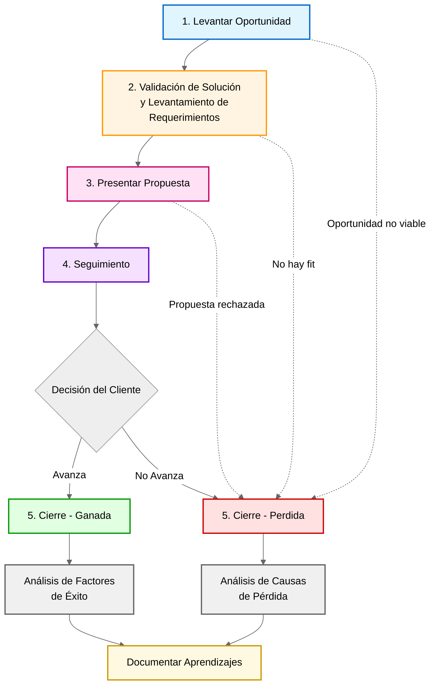

# Flujo de Ventas Consultiva de 23people

## Propósito

El Proceso de Venta Consultiva es la metodología estructurada de 5 etapas que tenemos en 23people para maximizar la conversión de ventas complejas.

Este proceso está diseñado para evitar el rol de "toma-pedidos" y posicionarnos como **asesores expertos confiables**. En ventas grandes, el cliente no compra una lista de tareas, compra la certeza de que resolveremos un problema que tiene en su negocio.

!!! warning "El Anti-Patrón: El 'Cotizador de Pedidos'"

    El error más común es actuar como un **"Cotizador de Pedidos/Requerimientos"**.

    * **El Cliente pide:** *"Necesito cotizar una página web con un formulario y tres secciones".*
    * **Vendedor Transaccional:** Toma nota de las secciones y envía un precio.
    * **Vendedor Consultivo (23people):** Se detiene y pregunta: *"¿Qué está pasando en tu negocio hoy que te hace pensar que una nueva web es la solución? ¿Qué problema de fondo buscas resolver?"*.

    Nuestro rol es diagnosticar el problema real, no solo poner precio a lo que el cliente cree que necesita.

## Pipeline de Ventas Consultivas (Proceso)

El siguiente diagrama ilustra el Flujo General de las Ventas Consultivas:

!!! info "Este es un flujo de Oportunidades Calificadas"

    Los items que pasarán en cada etapa corresponden a **Oportunidades Calificadas de Venta Consultiva**:

    - Son oportunidades que vienen desde el [Flujo de Prospección](./prospection-workflow.md).
    - Han sido calificadas como viables para avanzar en el proceso de ventas.

-----

## Etapa 1. Levantar Oportunidad (Diagnóstico)

### Objetivo

El objetivo no es tomar un pedido, sino **identificar la necesidad profunda (Causa Raíz)** detrás de la solicitud del cliente. Debemos validar que 23people puede resolver el problema real, no solo ejecutar la tarea que el cliente pide.

### Concepto Clave: Síntomas vs. Problemas

!!! quote "Filosofía de Diagnóstico"
    **"Los clientes en las primeras etapas no entienden el problema real, sino que solo manifiestan síntomas."**

Los clientes suelen llegar con una "solución preconcebida" (el síntoma). Nuestro trabajo es hacer las preguntas correctas (*"¿Por qué?", "¿Para qué?", "¿Qué impacto tiene esto?"*) para llegar al dolor real.

| Lo que dice el Cliente (Síntoma/Pedido)         | Lo que el Vendedor debe descubrir (Necesidad Real)                                               |
|:------------------------------------------------|:-------------------------------------------------------------------------------------------------|
| *"Necesito una app móvil para mis vendedores."* | *"Mis vendedores pierden 4 horas al día cargando datos manuales y las ventas han caído un 15%."* |
| *"Cotízame una migración a la nube."*           | *"Nuestro servidor local se cae en Black Friday y perdemos facturación crítica."*                |
| *"Necesito 3 perfiles de QA para mi equipo."*   | *"Estamos lanzando un producto nuevo y no tenemos capacidad para asegurar su calidad."*          |
| *"Quiero una página web con formulario."*       | *"No estamos captando leads calificados y el equipo comercial no tiene a quién llamar."*         |

### Definición de Listo

1. **Diagnóstico Claro**: Hemos identificado qué dolor de negocio está tratando de resolver el cliente (Causa Raíz).
2. **Validación de Aptitud**: Confirmamos que el problema del cliente entra en nuestra esfera de expertise.
3. **Compromiso de Continuidad**: El cliente acepta profundizar en una segunda reunión para explorar soluciones, entendiendo que su pedido inicial era solo un punto de partida.

-----

## Etapa 2. Validación de Solución y Levantamiento de Requerimientos

### Objetivo

Esta etapa tiene dos partes secuenciales críticas. Primero, validar la **Solución General** (nuestro enfoque macro) y, solo si eso hace sentido, proceder al **Levantamiento de Requerimientos** (detalles técnicos para cotizar).

### Diferencia: Solución vs. Requerimiento

Muchos vendedores confunden la solución con los requerimientos. En 23people, los diferenciamos así:

1. **La Solución (La Estrategia):** Es el servicio *macro* que proponemos para curar el tipo de "dolor" descubierto en la Etapa 1. Es como la plantilla o el marco de trabajo que usaremos (ej. Anteproyecto, Staff Augmentation, Consultoría).
2. **El Requerimiento (La Táctica):** Son los inputs técnicos, restricciones y especificaciones necesarias para costear e implementar esa solución (desde aqui se calculan horas, recursos, condiciones, etc. para armar la propuesta formal).

!!! example "Caso de Estudio: El Proyecto de Incertidumbre"

    **Contexto:** Un cliente llega diciendo: *"Necesito contratar 2 arquitectos senior por 3 meses para que nos ayuden a evaluar un gran proyecto que vamos a iniciar"* (Pedido/Síntoma).

    **Análisis de Necesidad Real (Etapa 1):** Detectamos que el cliente no necesita "horas de personas", sino **Seguridad Técnica**, **Mitigación de Riesgos** y **Apoyo confiable y experto en el area** por parte de un partner para poder avanzar con confianza en su proyecto.

    **Paso 1: Validación de la Solución (Macro)**

    En lugar de venderle 2 personas (que es lo que pidió), le proponemos una solución distinta:

    > *"Entendiendo que buscan seguridad para este gran proyecto, nuestra solución no es asignar personal por horas para esta oportunidad dado que el periodo es muy corto. En cambio,  nuestra solución apunta a ejecutar un **Servicio de Anteproyecto de Arquitectura**, el cual ha mostrado muy buenos resultados en otros clientes como ustedes que tenian un problema similar*
    >
    > *Permitanme detallar la metodologia de este servicio que se ejecuta en 3 fases bien definidas:*
    >
    > *A) Relevamiento de infraestructura actual,*
    > *B) Análisis de brechas,*
    > *C) Diseño de Hoja de Ruta.*
    >
    > *El entregable final es un Informe Técnico Ejecutivo validado por nuestros expertos."*

    * *Validación con el Cliente:* "¿Les hace sentido que abordemos esto como un proyecto con entregables fijos en vez de solo contratar horas?" -> **Si dicen SÍ, la solución está validada.**

    **Paso 2: Levantamiento de Requerimientos (Micro)**

    Ahora que acordamos hacer un "Anteproyecto", levantamos lo necesario para cotizarlo:

    - *"Necesitaremos acceso a su documentación actual."* (Requerimiento)
    - *"¿Podemos entrevistar a su CTO la próxima semana?"* (Requerimiento)
    - *"¿Tienen diagramas de red vigentes?"* (Requerimiento)

### Definición de Listo

1. **Fit de Solución Validado**: El cliente confirmó verbalmente que el enfoque propuesto (ej. Anteproyecto, Staff Augmentation, Consultoría) es el camino correcto.
2. **Requerimientos Claros**: Tenemos la lista técnica precisa necesaria para ponerle precio a esa solución validada.
3. **Desbloqueo de Información**: El cliente ha compartido información sensible (NDA/Accesos) necesaria para afinar la propuesta.

-----

## Etapa 3. Presentar Propuesta

### Objetivo

Presentar formalmente la solución técnico-comercial previamente acordada. En esta etapa, el cliente no debería sorprenderse con el "qué" (la solución) ni el "para qué" (la necesidad), solo debe validar el "cuánto" (inversión) y el "cómo" (plan de trabajo).

**Principio fundamental**: Las cotizaciones no se envían, se presentan.

### Definición de Listo

1. **Reunión Agendada**: La propuesta se presenta en una reunión sincrónica (video o presencial).
2. **Tomadores de Decisión Presentes**: Están presentes quienes tienen el poder de aprobar el presupuesto.
3. **Aclaración Inmediata**: Se resuelven dudas de alcance y comerciales en el momento.

-----

## Etapa 4. Seguimiento

### Objetivo

Generar una "deuda emocional" positiva y mantener el momentum. Evitar que la oportunidad se enfríe aportando valor constante.

### Estrategia de Valor

No preguntes *"¿Cómo vamos con la firma?"*. Aporta valor que refuerce que somos la solución a su problema raíz.

!!! tip "Ejemplo de Seguimiento Consultivo"

    *"Hola [Cliente], pensando en el problema de [Causa Raíz detectada en Etapa 1] que discutimos, encontré este artículo sobre cómo empresas similares lo resolvieron usando el enfoque de [Solución validada en Etapa 2]. Creo que refuerza por qué el camino que propusimos es el más seguro para ustedes."*

### Definición de Listo

1. **Feedback Transparente**: El cliente comunica el estado de sus procesos internos de aprobación.
2. **Interacción**: El cliente consume el contenido de valor (ej. casos de éxito) que enviamos.

-----

## Etapa 5. Cierre

### Objetivo

Formalizar la relación comercial (Ganada) o aprender de la pérdida (Perdida). Entender las **causas específicas** del resultado es vital para la mejora continua.

### Análisis Post-Mortem

Independientemente del resultado, debemos volver a la Etapa 1 y 2 para analizar:

* **Si Ganamos:** ¿Fue porque entendimos la necesidad mejor que la competencia? ¿Nuestra solución (ej. Anteproyecto) les dio más seguridad?
* **Si Perdimos:** ¿Fallamos en diagnosticar el problema real? ¿Propusimos una solución que el cliente no valoró? ¿Los requerimientos estaban mal levantados y quedamos fuera de precio?

### Definición de Listo

1. **Causa Raíz del Resultado**: Documentada claramente (Precio, Expertise, Enfoque Técnico, Relacionamiento).
2. **Documentación**: Contrato firmado o registro de "Lost Reason" en el CRM.

-----

## Principios Fundamentales

1. **Diagnosticar antes de Recetar**: Nunca ofrezcas una solución (receta) sin entender profundamente el dolor (diagnóstico).
2. **La Prospección Facilita la Venta**: Un buen "gancho" en prospección ya trae el problema a la mesa.
3. **El Cliente Debe Querer Avanzar**: No empujes al cliente; guíalo para que él decida dar el siguiente paso.
4. **Calificar es Madurez**: Saber decir "no" cuando no hay fit es tan importante como ganar una venta.
5. **Control Mediante Preguntas**: Quien hace las preguntas controla la reunión.

-----

## Referencias

* [Notas del Taller de Marketing y Ventas Consultivas con MCI Consultores](https://drive.google.com/drive/folders/1y15dXIJvXxXEIhgVbwjioFuh_bubBBmy?usp=drive_link)
