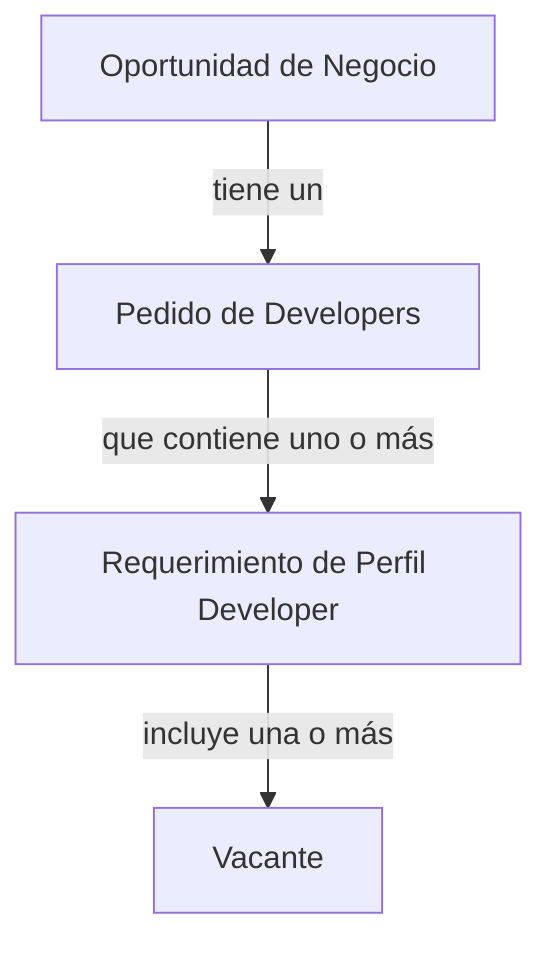
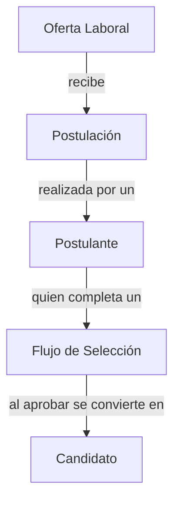

# Glosario de Tech Talent Services

Este es el registro oficial de todos aquellos conceptos, expresiones y
acuerdos de definición que se usen en la comunicación diaria en temas
asociados a los servicios de Tech Talent Services.

El objetivo es el poder alinear el conocimiento que se va adquiriendo a lo
largo del tiempo y así poder transmitirlo a las personas de una manera más
eficiente y efectiva.

## Conceptos Generales

[`Developer`](){#developer}

:  Se define como un individuo (persona) con formación, experiencia y/o habilidades
especializadas en el campo de las Tecnologías de la Información (TI).

    Características clave:

    - Tiene competencias desarrolladas en programación.
    - Posee conocimientos técnicos en una o más áreas de TI, como desarrollo de software, administración de sistemas, seguridad informática, análisis de datos, inteligencia artificial, entre otras.
    - Puede tener formación académica formal en campos relacionados con TI (como ingeniería informática, ciencias de la computación, sistemas de información, etc.) y/o certificaciones profesionales relevantes.
    - Cuenta con experiencia práctica en proyectos o roles relacionados con TI.
    - Puede especializarse en tecnologías, lenguajes de programación o metodologías específicas.

[`Perfil Developer (o Perfil Tech)`](){#perfil-tech}

:   Se define como el conjunto de características, habilidades, conocimientos y
experiencias profesionales que describen a un Profesional Tech en un momento
específico de su carrera.

    Un profesional puede desarrollar múltiples perfiles Tech a lo largo de su trayectoria.

[`Niveles de Experiencia de Developers`](){#niveles-experiencia-developers}

:   Corrensponden al grado de experiencia y conocimientos que un Profesional Tech. Estos niveles son:

    - **Entry**: Profesionales con poca o ninguna experiencia laboral en el campo de Tech.

    - **Entry Avanzado**: Profesionales con experiencia laboral limitada en el campo de Tech.

    - **Midlevel**: Profesionales con experiencia laboral moderada en el campo de Tech.

    - **Senior**: Profesionales con amplia experiencia laboral y conocimientos avanzados en el campo de Tech.

## Conceptos Comerciales



[`Oportunidad de Negocio`](){#oportunidad-negocio}

:   Corresponde a un pedido específico de Perfiles de Profesionales Tech realizado por un cliente
(nuevo o existente) y que representa la posibilidad de concretar una venta de
nuestros servicios de Outsourcing o Hunting Tech.

    Características clave:

    - Una Oportunidad de Negocio tiene uno y sólo un [Pedido](#pedido) asociado.

[`Pedido de Developers`](){#pedido-developers}

:   Se define como la solicitud formal de un cliente que engloba uno o más
Requerimientos de Perfiles Tech.

    Características clave:

    - Está asociado a una Oportunidad de Negocio específica.

    - Contiene uno o más Requerimientos de Perfiles Tech.

    - Representa la necesidad total de talento Tech del cliente en un momento dado.

[`Requerimiento de Perfil Developer`](){#requerimiento-perfil-developer}

:   Se define como una solicitud específica de un tipo de Perfil Tech
dentro de un Pedido.

    Características clave:

    - Forma parte de un Pedido hecho a Tech Talent.

    - Describe un perfil profesional específico solicitado por el cliente.

    - Puede incluir una o más Vacantes Tech a ser cubiertas.

    - Define las características y habilidades requeridas para un rol particular.

[`Vacantes`](){#vacantes}

:   Se define como el número de posiciones individuales disponibles de ser completados para un Requerimiento
de Perfil Tech específico.

    Características clave:

    - Representa una oportunidad laboral concreta para un Profesional Tech.

    - Un Requerimiento de Perfil Tech puede tener uno o más Vacantes Tech disponibles de ser completados.

    - Indica el número de profesionales que el cliente está dispuesto a contratar para un perfil específico.

## Conceptos de Selección de Developers



[`Oferta Laboral para Developers`](){#oferta-laboral-developers}

:   Se define como una propuesta formal de empleo que describe las condiciones y requisitos de un puesto de trabajo específico.

    Características clave:

    - Contiene información detallada sobre el puesto, las responsabilidades, los requisitos, las condiciones laborales y los beneficios asociados.

    - Representa una oportunidad de empleo concreta para un Profesional Tech.

    - Puede ser anunciada públicamente o presentada directamente a un Profesional Tech.

[`Flujo de Selección de Developers`](){#flujo-seleccion-developers}

:   Conjunto de etapas y actividades establecidas por 23people para evaluar a los desarrolladores que postulan a nuestras [ofertas laborales](#oferta-laboral-developers). A través de este proceso, el equipo de Tech Talent Services (TTS) valida que los candidatos cumplan con nuestros estándares de calidad antes de presentarlos a nuestros clientes para entrevistas.

    Incluye las etapas de: 
  
    1. **Nueva Postulación**. Se recibe una nueva postulación a una oferta laboral.
    2. **Filtro Curricular**. Se evalua a priori si el perfil del developer se ajusta a los requisitos de la oferta laboral.
    3. **Evaluación Técnica**.
          1. **Desafío Técnico**. Consiste en la realización de una Prueba Tecnica, que busca evaluar la capacidad de programación y resolución de problemas algorítmicos.
          2. **Validación de Experiencia Técnica**. Consiste en una entrevista de caracter tecnico, en donde se busca validar la experiencia laboral y conocimientos técnicos del postulante.
    4. **Evaluación de Nivel de Idiomas**. Se evalua el nivel de idiomas del profesional.
    5. **Listo como Candidato**. Se ha completado satisfactoriamente el flujo de selección y se ha evaluado como apto para ser presentado a entrevista con el cliente como uno de nuestros [Candidatos](#candidato).

    ```mermaid
    ---
    config:
        kanban:
            ticketBaseUrl: '<https://mermaidchart.atlassian.net/browse/#TICKET#>'
    ---
    kanban
        Nueva Postulación
            [Postulación D]        
        Filtro Curricular
            [Postulación E]
            [Postulación F]
            [Postulación H]
        Evaluación Técnica
            [Postulación A]
            [Postulación B]
        Evaluación de Idiomas
        Listo como Candidato
            [Postulación C]
            [Postulación G]
    ```

    !!! warning "Nota"

        Lo que se evalúa es el perfil del profesional en ese momento determinado. El mismo profesional puede postular a otra oferta laboral en el futuro en donde se necesite otro perfil tech. De esta manera, no se filtra a profesionales, sino que al perfil que presentó en esa [oferta laboral](#oferta-laboral-developers).

[`Postulación`](){#postulacion}

:   Se define como el proceso mediante el cual un [Developer](#developer) voluntariamente se presenta para ser evaluado como una opción para una de las vacantes de una oferta laboral anunciada por 23people.

    Características clave:

    - Un Developer puede tener múltiples postulaciones registradas con nuestra empresa.

    - Cada postulación relaciona una [oferta laboral](#oferta-laboral-developers) específica y un profesional especifico en un momento determinado.

    - La postulación marca el inicio del [flujo de selección](#flujo-seleccion-developers) para el [perfil](#perfil-dev) del profesional.

[`Postulante`](){#postulante}

:   Se considera Postulante a Developer que ha presentado su postulación a una oferta laboral nuestra.

[`Candidato`](){#candidato}

:   Se considera Candidato a todo Developer que cumple con las siguientes
condiciones:

    1. Ha postulado a una o más ofertas laborales de 23people.

    2. Ha completado satisfactoriamente nuestro [Flujo de Selección de Developers](#oferta-laboral-developers).

    Características importantes:

    - El estado de Candidato es dinámico y depende del [perfil profesional](#perfil-developer) actual del individuo en relación con las ofertas laborales disponibles.

    - Un Profesional Tech puede ser considerado Candidato para múltiples ofertas laborales y/o clientes, siempre que su perfil se ajuste a los requisitos específicos de cada caso.

    - La designación como Candidato no es permanente y puede variar según cambios en el perfil profesional o en los requisitos de las ofertas laborales.
  
[`Prueba Técnica`](){#prueba-tecnica}

:   Es una prueba que evalua las competencias de programación y resolución cognitiva de problemas que tiene un Developer.

    Características clave:

    - Consiste de una serie de ejercicios prácticos de programación en las que se tiene que usar la técnica de recursividad.
    - Tiene que ser completada en un tiempo determinado.
    - Debe ser de manera sincrona y en tiempo real la evaluación. Puede ser remotamente o presencial.

[`Entrevista Técnica`](){#entrevista-tecnica}

:   Es una entrevista personalizada en donde se evalua la experiencia, habilidades técnicas requeridas por el perfil solicitado.

    Características clave:

    - Se evalua la experiencia laboral: Que tenga la experiencia que dice que tiene
    - Consiste de un conjunto de preguntas que son asociadas a lo tecnico y las formas de trabajo. Determinar si le gusta o no lo que hace.
    - Se genera una conversación técnica para evaluar la experiencia y conocimientos del profesional. Con base en esto se realizan mas preguntas.
    - Se evalua experiecnia sobre tecnologias especificas, y si profundizo en los conceptos. Los que profundizan en general son mejores desarrolladores (e.g. Leer manuales, guias, tutoriales, videos, etc.).
    - Se preguntan temas sobre cosas que ya se han probado antes por parte de los entrevistadores. 
    - Se deben hacer contrapreguntas sobre las tecnologias que indica que maneja para saber si realmente las maneja.
    - Si las personas mencionan las versiones de las tecnologías, es un indicador de que realmente las maneja. Dado que han enfrentado problemas con las versiones anteriores o compatibilidad con otras tecnologias.
    - Deben conocer lo requerido y acordado en el requerimiento de perfil tech junto al cliente.
    - Si los profesionales no saben algo, deben decirlo. No mentir sobre lo que saben o no saben.
    - Si los profesionales hablan sobre patrones de diseño y buenas practicas, es un indicador de que han trabajado en proyectos grandes y complejos. Quizas han llegado a esos conceptos o compartirlos luego de mucho tiempo
    - Se puede preguntar por programacion funcional. Se busca si hay interes por estos temas.
    - Es el perfil de la persona lo que se evalua, no la persona en si misma. Se evalua si la persona es capaz de hacer el trabajo que se le esta solicitando. La misma persona puede ser rechazada en una oferta laboral y aceptada en otra.
    - Antes de la entrevista, se deberia revisar y tener claro el como se desempeñó en la prueba técnica.

## Conceptos Técnicos

[`Recursividad`](){#recursividad}

:   Técnica de programación donde una función se llama a sí misma para resolver un problema dividiéndolo en problemas más pequeños del mismo tipo. Por ejemplo, obtener cubos de hielo individuales a partir de un bloque grande requiere repetir el proceso de división en bloques más pequeños hasta alcanzar el tamaño deseado.

    Características clave:

    - Permite resolver problemas complejos de manera más simple y elegante.
    - Requiere un caso base que detenga la recursión.
    - Puede ser más eficiente que otras técnicas de programación en ciertos casos.
    - No es algo que se deba usar siempre en las actividades de desarrollo, pero el manejo de esta técnica es un indicador de habilidad.

[`Algoritmo`](){#algoritmo}

:   Conjunto de instrucciones o reglas definidas y ordenadas que describen un proceso o cálculo que se lleva a cabo para resolver un problema específico. Los algoritmos son la base de la programación y la informática, y se utilizan para diseñar software, sistemas y aplicaciones. Se puede considerar como algo similar a una receta de cocina.

[`Abstracción`](){#abstraccion}

:   Proceso de simplificación y reducción de la complejidad de un sistema o problema mediante la identificación y aislamiento de los elementos esenciales y la omisión de los detalles innecesarios. En programación, la abstracción se utiliza para representar conceptos y datos de manera simplificada y estructurada, lo que facilita la comprensión y el manejo de la información.

[`Complejidad de un ejercicio de programación`](){#complejidad-ejercicio-programacion}

:   Se define por la dificultad que el equipo reclutador de 23people tuvo al momento de resolver ellos mismos el ejercicio. También se puede usar las estadísticas que se han generado en la plataforma de apoyo para realizar pruebas online de programación, respecto de las tendencias de tiempos que los postulantes han usado para resolver el ejercicio.
