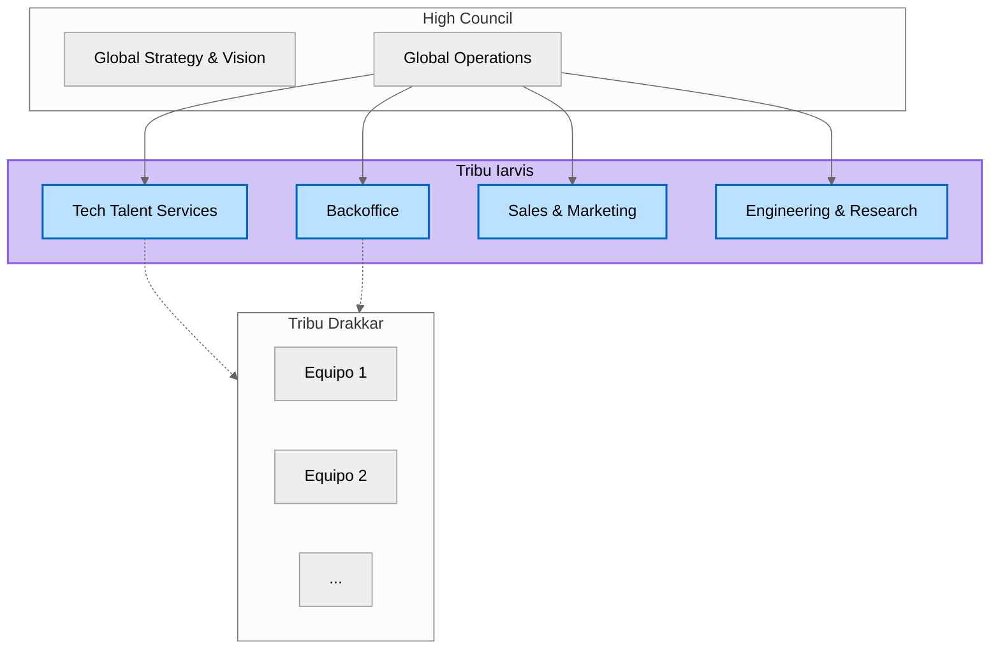

# La Tribu Iarvis

La Tribu Iarvis es la que agrupa a todos los equipos operacionales de 23people.

## Propósito

El propósito de la Tribu Iarvis es potenciar la entrega de servicios de alta calidad y sostenibles, alineados con los objetivos estratégicos de 23people, mediante la colaboración efectiva entre sus equipos operacionales.

## Esquema General

## Equipos de Iarvis

La Tribu Iarvis está compuesta por los siguientes equipos operacionales:

- [**Tech Talent Services Team (TTS)**](/organization/teams/tech-talent-services/): Encargado de la selección, validación y retención de profesionales tech.
- [**Sales & Marketing Team (S&M)**](/organization/teams/sales-and-marketing/): Responsable de la adquisición de nuevos clientes y la gestión de relaciones comerciales.
- [**Backoffice Services Team (BKO)**](/organization/teams/backoffice/): Proporciona soporte administrativo empresarial.
- [**Engineering & Research Team (R&D)**](/organization/teams/engineering-and-research/): Explora y domina tecnologías emergentes para generar valor real en las operaciones de los clientes.

## Como trabajan los Equipos Operacionales

Cada equipo tiene autonomía entorno a un próposito bien definido y un contrato de servicios que se compromete a entregar. Estos contratos funcionan similar a como funcionan las [API](https://aws.amazon.com/what-is/api/) y se espera que se especifique: que entrega, que esperar del servicio y como se solicita. Cada equipo debe medir constantemente la calidad de sus servicios y su eficiencial operacional, para luego mejorarlos de manera iterativa basandose en datos y experiencia acumulada.

## Gestión y Liderazgo Operacional

Los equipos operacionales están liderados por el rol del **Global Operations Director**. Además, cada equipo cuenta con un/a líder que cumple con el rol principal de **Service Request Manager (SRM)** y secundariamente con el rol de **Service Delivery Manager (SDM)**.
