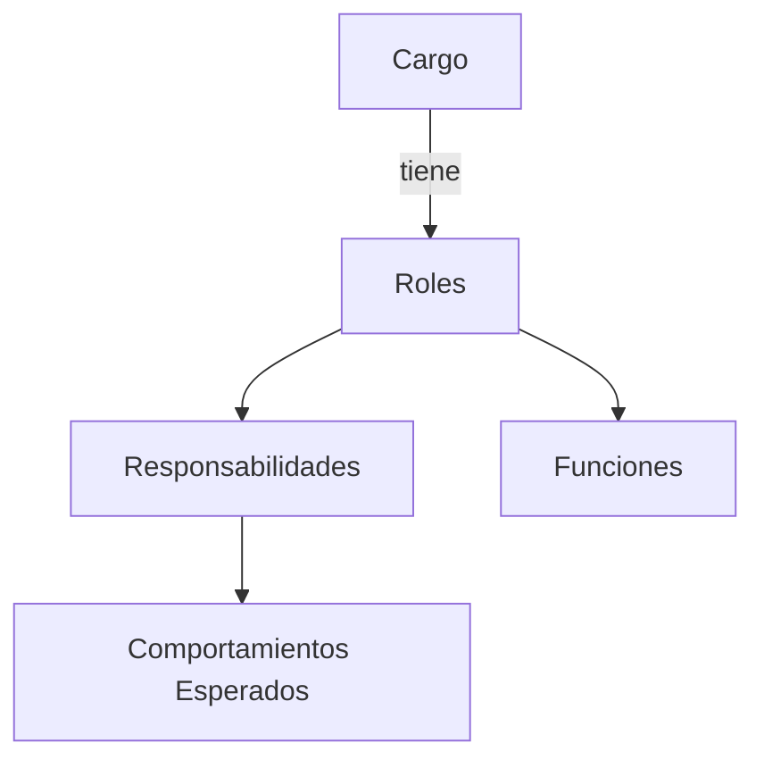

# Cargos y Roles

En 23people nos organizamos en equipos multidisciplinarios. Cada equipo tiene un propósito claro y bien definido, y es responsable de la entrega de servicios a otros equipos internos o a clientes externos.

Nos organizamos además en base a [**Cargos**](workforce/positions/) y [**Roles**](workforce/roles/), que definen las responsabilidades y comportamientos esperados de cada miembro de la organización. Cada cargo, puede tener uno o mas roles asignados, los cuales definen las responsabilidades y funciones necesarias para el cargo.

En 23people, entendemos los cargos y roles como dos conceptos distintos pero complementarios que estructuran nuestra organización y la forma en que trabajamos.

## Relación entre Cargos, Roles y Equipos

Los cargos no están limitados a un equipo específico. Un mismo cargo puede existir en diferentes equipos de 23people (Tech Talent Services, Sales & Growth Marketing, Backoffice Services, Research & Development), y el profesional puede desempeñar distintos roles según el equipo donde se encuentre. Por ejemplo:

- Un **Senior Software Engineer** podría estar:
    - En R&D Services como Tech Lead de un proyecto de innovación
    - En Tech Talent Services como Technical Interviewer
    - En cualquier equipo como Software Architect

- Un **Data Engineer** podría estar:
    - En R&D Services desarrollando soluciones de datos
    - En Tech Talent Services analizando métricas de reclutamiento
    - En Sales & Growth Marketing trabajando con datos de ventas

Esta flexibilidad permite:

- Aprovechar las competencias base del cargo en diferentes contextos
- Facilitar la movilidad interna y el desarrollo profesional
- Mantener consistencia en los niveles y expectativas a través de la organización

### Aspectos Organizacionales

#### Autonomía y Responsabilidad

- Cada nivel superior implica mayor autonomía estratégica
- El alcance de responsabilidad aumenta progresivamente
- El impacto de decisiones se amplía en niveles superiores
- La contribución evoluciona de tareas específicas a metas organizacionales

#### Alineación Organizacional

- La estructura soporta la jerarquía de contribución del trabajo
- Permite desarrollo en carreras técnicas y de gestión
- Facilita la trazabilidad desde tareas hasta metas de largo plazo
- Soporta el modelo de tribus y equipos

#### Evaluación y Promoción

- Se basa en la demostración de capacidades del siguiente nivel
- Considera impacto en la jerarquía de contribución
- Evalúa tanto competencias técnicas como estratégicas
- Requiere crecimiento consistente y verificable

## Principios

Todos los equipos de 23people deben orientar sus actividades diarias según los siguientes principios:

- **Propósito claro y bien definido**: Cada equipo tiene un propósito que actúa como brújula en su día a día. Es su razón de existir en 23people y lo que motiva su avance.
- **Autonomía en torno a su propósito**: Cada equipo es autónomo en la forma de avanzar hacia su propósito, alineándose con los [objetivos estratégicos](../strategy/goals.md), [valores](../culture/values.md) y [prácticas generales](../culture/practices/) de la organización.
- **Cumplimiento del propósito mediante contratos de servicio**: Cada equipo persigue su propósito entregando servicios a otros equipos internos o a clientes externos. Estos servicios están bien definidos en forma de contrato de servicio (similar a una API). Toda la organización debe conocer qué esperar de cada equipo y cómo solicitar sus servicios.
- **Mejora iterativa basada en datos**: Los equipos mejoran sus servicios implementando ideas que aportan de manera medible a la eficiencia operacional y calidad. Estas mejoras se fundamentan en su experiencia, datos recolectados y nuevas ideas que desean poner a prueba.
