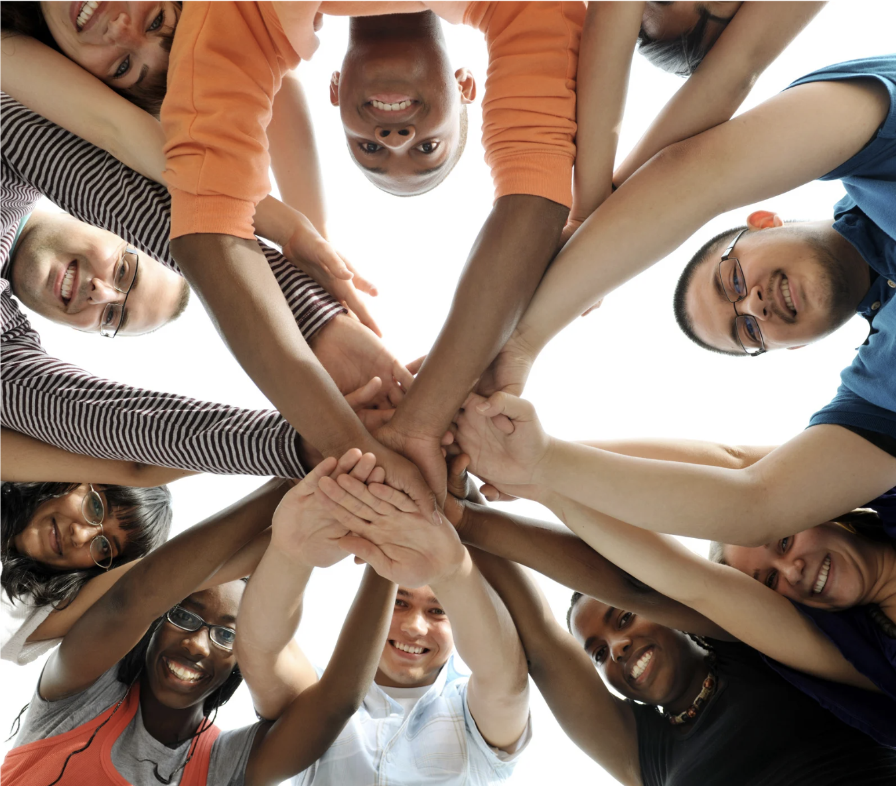

# Equidad

Creemos en una empresa humana y motivante. Buscamos que todas las personas sean tratadas de forma respetuosa e igualitaria.

## Discriminación

El talento se encuentra distribuído uniformemente en nuestra sociedad. Por esa razón evitamos cualquier tipo de discriminación al momento de seleccionar profesionales para nuestra empresa.

Los sesgos personales no deben afectar nuestro proceso de selección. Consideraciones como nacionalidad, universidad, colegio o ubicación no tienen cabida en ése proceso.

## Discriminación positiva

Queremos que 23people sea una representación de la sociedad en la que está inserta. Aún así **no hacemos discriminación positiva previa**.

Aplicamos discriminación positiva cuando entre dos candidatos evaluados al mismo nivel y que han pasado por el mismo proceso de selección elegimos a quien represente un grupo sub representado en nuestra compañia. Esto aplica a contrataciones directas y no a outsourcing donde el cliente es quién finalmente elije.
