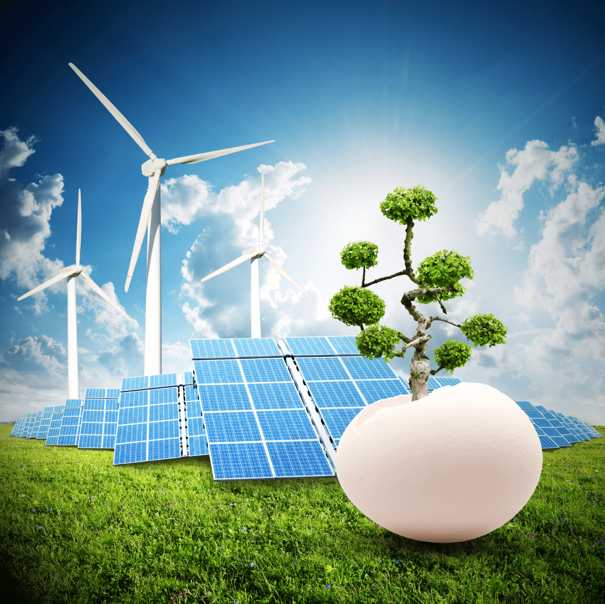

# Sustentabilidad

[English version](https://manual-23people-io.translate.goog/principles/sustainability/?_x_tr_sl=es&_x_tr_tl=en&_x_tr_hl=es&_x_tr_pto=wapp)

Cuando decimos que queremos tener un negocio sostenible y sustentable nos referimos a que estamos **comprometidos en una visión de largo plazo** con el objetivo de hacer **uso correcto** de los **recursos naturales, financieros y sociales** sin comprometer los de las **generaciones futuras**. 

Participamos activamente en la sociedad y en sus esfuerzos por detener la degradación ambiental, mejorar la educación y promover la evolución social.

Para eso privilegiamos actividades, servicios y tecnologías que permitan rebajar los efectos adversos a los ecosistemas y sociedades.

## Trabajo remoto

**Privilegiamos** el trabajo remoto  considerando que plantea una serie de beneficios sociales y ambientales.

- Mejor calidad de vida y bienestar al eliminar tiempo de desplazamiento disminuyendo la huella de carbono.
- Comunidad descentralizada al no requerir que las personas estén obligadas a vivir en grandes ciudades.
- Disminución de costos de infraestructura y generación de residuos sólidos, plásticos.
- Menor consumo de combustibles fósiles, agua y químicos asociados a la mantención de espacios de trabajo compartidos.

## Digitalización

Nos definimos como una empresa 100% digital y 100% Cloud lo que significa que nuestros procesos, documentos y comunicaciones pertenecen al ámbito digital.  Esto nos permite optimizar recursos y disminuir su impacto ambiental.

Algunas ventajas de la digitalización son:

### Reducción del uso de papel

Al implementar archivos digitales, sistemas en la nube y herramientas de colaboración en línea, se disminuye drásticamente la necesidad de imprimir documentos físicos.
Se ahorran recursos naturales (árboles, agua, energía) y se reduce el volumen de residuos en forma de papel y cartuchos de impresora.

### Mejora en la eficiencia de procesos

Al digitalizar, muchos trámites y flujos de trabajo que antes eran presenciales o requerían formatos físicos pueden llevarse a cabo de manera virtual.
Esta eficiencia se traduce en un menor consumo de energía, ya que se evitan desplazamientos innecesarios y se acelera la toma de decisiones y la resolución de problemas.

### Menor dependencia de espacios físicos

Con la digitalización, las organizaciones pueden optar por oficinas más compactas o incluso modelos de trabajo remoto o híbrido.
Esto reduce el uso de recursos para mantener instalaciones grandes (por ejemplo, electricidad, agua, calefacción, aire acondicionado), con la consiguiente disminución en la huella de carbono.

### Optimización de la logística y el transporte

La automatización y el seguimiento digital de inventarios y envíos permiten planificar mejor las rutas de transporte y la distribución de productos.
Un mayor control sobre el stock y las entregas evita viajes innecesarios o pedidos duplicados, reduciendo el consumo de combustibles y las emisiones de CO₂.

### Mayor transparencia y trazabilidad en la cadena de suministro

Al contar con datos en línea en tiempo real, se facilita la identificación y reducción de ineficiencias en la producción, el transporte y la entrega.
Es posible monitorizar el origen de los insumos, las condiciones de producción y la huella ambiental de cada etapa, fomentando prácticas más responsables.

### Gestión inteligente de recursos y energía (IoT)

Con la digitalización, el uso de dispositivos inteligentes (IoT) facilita la recolección de datos sobre el consumo energético, la temperatura, la iluminación y otros parámetros.
Este análisis permite ajustar de forma automática las condiciones de operación (por ejemplo, ajustando la climatización o apagando luces cuando no se necesitan), optimizando el uso de energía y disminuyendo el impacto ambiental.

### Facilitación de la innovación y la mejora continua

Las herramientas digitales recogen datos de manera sistemática y confiable, lo cual ayuda a las empresas a identificar oportunidades de mejora y a innovar de forma constante.
Una toma de decisiones basada en datos promueve soluciones más eficientes y alineadas con la sostenibilidad.

### Impulso al teletrabajo y la colaboración virtual

Plataformas de videoconferencia, mensajería instantánea y herramientas de gestión de proyectos permiten a los equipos trabajar de manera colaborativa desde distintos lugares.
Esto disminuye la necesidad de desplazamientos, reduce la emisión de gases de efecto invernadero y mejora el balance entre la vida personal y laboral.

### Menor generación de residuos electrónicos

Si bien la digitalización implica el uso de dispositivos electrónicos, la adopción de servicios en la nube y la virtualización de servidores disminuye la necesidad de equipos físicos dedicados (servidores locales obsoletos, discos duros, etc.).
Un correcto mantenimiento y actualización de los dispositivos, junto con prácticas de reciclaje responsables, contribuye a reducir la generación de e-waste.

## Tecnología, Impacto Ambiental y Carbono Neutral

Aunque 23people es una empresa es digital y remota, sigue generando una huella de carbono digital a través de servidores, dispositivos y consumo energético.

Para mitigar nuestra huella de carbono creamos una política de sustentabilidad que considera:

- Utilizar servicios cloud y data centers que usen energías limpias.
- Medir nuestra huella de carbono en dispositivos de los empleados y plataformas digitales utilizadas.
- Fomentar la compra de hardware de marcas sostenibles.
- Implementar programas de reciclaje y reutilización de dispositivos.
- Utilizar aplicaciones que compensen emisiones de carbono como Betterfly.

