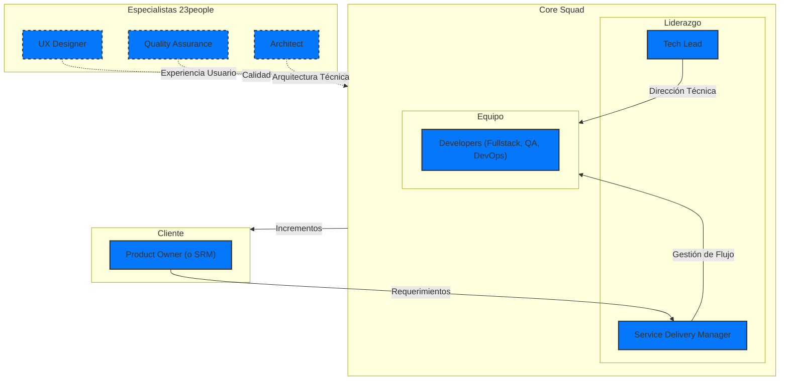

# Software Squad

```mermaid
flowchart TB
    subgraph Consulting["Especialistas 23people"]
        direction LR
        UXC["UX Designer"]
        QSC["Quality Assurance"]
        ARC["Architect"]
    end

    subgraph Client["Cliente"]
        PO["Product Owner (o SRM)"]
    end

    subgraph Squad["Core Squad"]
        subgraph Leadership["Liderazgo"]
            SDM["Service Delivery Manager"]
            TL["Tech Lead"]
        end
        
        subgraph Team["Equipo"]
            Dev["Developers (Fullstack, QA, DevOps)"]
        end
    end

    %% Flujos principales
    PO -->|"Requerimientos"| SDM
    SDM -->|"Gestión de Flujo"| Team
    TL -->|"Dirección Técnica"| Team
    
    %% Interacciones consultivas
    UXC -.->|"Experiencia Usuario"| Squad
    QSC -.->|"Calidad"| Squad
    ARC -.->|"Arquitectura Técnica"| Squad
    
    %% Entregables
    Squad -->|"Incrementos"| Client

    %% Estilos
    classDef clientNode fill:#0577fa,stroke:#333,stroke-width:2px
    classDef squadNode fill:#0577fa,stroke:#333,stroke-width:2px
    classDef consultingNode fill:#0577fa,stroke:#333,stroke-width:2px,stroke-dasharray: 5 5
    
    class PO clientNode
    class SDM,TL,Dev,D,Q,U squadNode
    class UXC,QSC,ARC consultingNode
```
