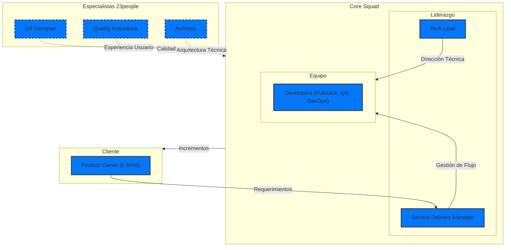

# Madures en desarrollo de software

!!! example ""

    **Co-construimos software empresarial** en una manera ágil, evolutiva y basados en datos.

Hemos adoptado una metodología de desarrollo de software ágil que nos permite construir productos digitales de alta calidad, evolutivos y basados en datos. Nuestro enfoque se basa en la colaboración, la transparencia y la iteración continua, permitiéndonos adaptarnos a los cambios y entregar valor de manera eficiente.

## Principios

..

## Roles y Responsabilidades

## Procesos

..

## Gestión Ágil de Proyectos

..

## Buenas prácticas

...
