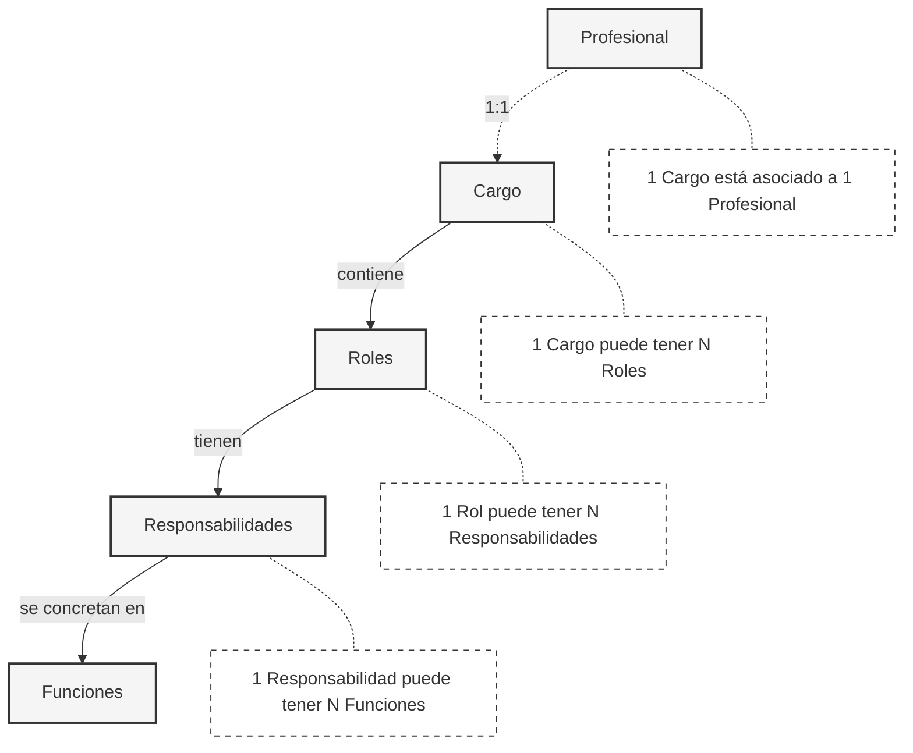

# Jerarquía Organizacional: Cargos, Roles, Responsabilidades y Funciones

## Relación de Conceptos

Los cargos laborales, roles, funciones y responsabilidades forman una jerarquía de conceptos organizacionales interconectados que evolucionan de lo estructural a lo operativo.

El **cargo laboral** representa la posición formal en la estructura organizacional. Es más permanente en el tiempo y tiene niveles jerárquicos. Un cargo solo puede estar asociado a una y solo una persona. Actúa como un contenedor que puede albergar múltiples roles.

Los **roles**, a su vez, son más flexibles en el tiempo y definen ámbitos de acción específicos y se materializan a través de **responsabilidades** concretas - los resultados esperados.

Finalmente, las **funciones** son las actividades específicas y tangibles que permiten cumplir con esas responsabilidades. Cada responsabilidad se implementa mediante una o más funciones específicas que contribuyen directamente a su cumplimiento.

## Esquema de Relaciones

## Ejemplos

A continuación, se presentan ejemplos de cómo se relacionan estos conceptos en la práctica organizacional, mostrando claramente la relación entre responsabilidades y sus funciones específicas.

### Ejemplo 1: Senior Software Engineer

| Rol                        | Responsabilidad                     | Funciones                                                                                                                               |
|----------------------------|-------------------------------------|-----------------------------------------------------------------------------------------------------------------------------------------|
| Technical Lead             | Diseño de arquitectura de servicios | • Revisar diseños de arquitectura propuestos • Liderar sesiones técnicas de diseño • Documentar decisiones de arquitectura              |
|                            | Aseguramiento de calidad técnica    | • Validar estándares de código • Supervisar implementación de patrones de diseño • Realizar auditorías de calidad de código             |
|                            | Mentoring técnico del equipo        | • Realizar sesiones de mentoring programadas • Proporcionar feedback técnico en code reviews • Crear materiales de capacitación técnica |
| Cloud Infrastructure Owner | Gestión de infraestructura cloud    | • Diseñar arquitectura cloud de servicios • Supervisar implementaciones de IaC • Mantener documentación de infraestructura              |
|                            | Optimización de recursos y costos   | • Monitorear y analizar costos cloud mensuales • Implementar estrategias de optimización • Generar reportes de eficiencia de recursos   |

### Ejemplo 2: Senior People Manager

| Rol                                   | Responsabilidad                           | Funciones                                                                                                                 |
|---------------------------------------|-------------------------------------------|---------------------------------------------------------------------------------------------------------------------------|
| Compensation & Benefits Administrator | Gestión integral de remuneraciones        | • Supervisar proceso de payroll mensual • Validar cálculos de remuneraciones • Revisar declaraciones previsionales        |
|                                       | Administración de beneficios corporativos | • Gestionar programa de beneficios • Actualizar políticas de beneficios • Coordinar con proveedores de beneficios         |
| Labor Compliance Leader               | Asegurar cumplimiento normativo laboral   | • Supervisar proceso de contratos y anexos • Gestionar auditorías laborales • Mantener registro de cumplimiento normativo |
|                                       | Gestión de documentación legal            | • Validar documentación legal requerida • Mantener actualización de políticas • Coordinar con asesores legales externos   |
| Employee Experience Owner             | Gestión del ciclo de vida laboral         | • Liderar programa de onboarding • Gestionar proceso de evaluaciones de desempeño • Coordinar procesos de offboarding     |
|                                       | Desarrollo de cultura organizacional      | • Coordinar actividades de cultura • Implementar iniciativas de engagement • Monitorear indicadores de clima laboral      |
| HR Analytics Lead                     | Gestión de métricas e indicadores HR      | • Generar reportes mensuales de gestión HR • Mantener dashboard de indicadores clave • Analizar tendencias de personal    |
|                                       | Optimización de procesos HR               | • Documentar procesos actuales • Identificar oportunidades de mejora • Implementar optimizaciones basadas en datos        |
